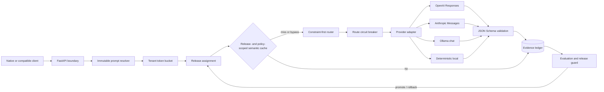
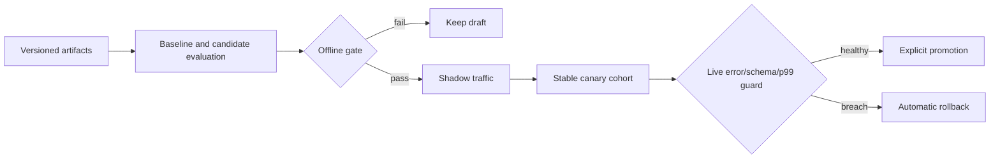

# Aegis AI Gateway

[](https://github.com/kevinmeix1/multi-model-ai-gateway/actions/workflows/ci.yml)
[](https://www.python.org/)
[](LICENSE)

A policy-first multi-model inference gateway with an evaluation and release control plane.

Aegis routes requests across OpenAI, Anthropic, Ollama, and deterministic local adapters only after
the route satisfies capability, privacy, region, context, latency, and cost constraints. It adds
normalized streaming, semantic caching, tenant rate limits, circuit breakers, compatible fallback,
immutable registries, shadow traffic, deterministic canaries, offline evaluation, and automated
rollback.

This repository is an executable single-process reference. It runs end to end on a laptop without
provider credentials and documents the state/services that must change before multi-replica or public
deployment.

## Why it exists

Choosing a model because its endpoint is up is not enough. The same application may handle an
EU-restricted document, a public low-cost summary, a long-context coding task, and a latency-critical
structured response. Those requests do not have the same eligible provider set.

Aegis treats routing as constrained optimization:

```text
request contract
    -> hard eligibility filters
    -> utility ranking inside the feasible set
    -> provider attempt
    -> schema and evidence checks
    -> constrained fallback or typed failure
```

Canary preference and fallback cannot weaken hard policy. Once streamed content is exposed, the
gateway never silently changes models.

## Architecture



The main design rules are documented as
[architecture decision records](docs/decisions/README.md), not left implicit in code.

## What is implemented

- Native `POST /v1/generate` and a narrow OpenAI-compatible `POST /v1/chat/completions` API.
- Current OpenAI Responses, Anthropic Messages, Ollama Chat, and deterministic adapters.
- Complete-response and normalized SSE/NDJSON streaming paths.
- Capability, privacy, region, context, p95 latency, worst-case cost, circuit, and enabled-state
  filters.
- Explicit quality/latency/cost utility with measurable routing regret.
- Per-tenant token buckets and one-probe half-open circuit breakers.
- Fallback only among routes that satisfy the original request contract.
- Bounded tenant/policy/release-scoped semantic cache with TTL and LRU eviction.
- Immutable prompt, dataset, model-catalogue, and policy artifacts.
- Stable request-hash canaries, shadow traffic, offline gates, promotion, and rollback.
- Schema compliance, TTFT, p99, cost per success, failover success, regret, and rollback evidence.
- SQLite evidence ledger, Prometheus endpoint, and structured completion logs.
- Docker, Compose, Kubernetes reference manifests, and GitHub Actions CI.
- 60 deterministic tests with enforced branch coverage, type checking, linting, secret scan, and
  concurrency benchmark.

## Quick start

Requirements: Python 3.12 or later.

```bash
git clone https://github.com/kevinmeix1/multi-model-ai-gateway.git
cd multi-model-ai-gateway
python3.12 -m venv .venv
. .venv/bin/activate
python -m pip install -e '.[dev]'
cp .env.example .env
python scripts/seed_demo.py
aegis --reload
```

The deterministic routes are enabled by default. No API key or network call is needed. Open:

- API documentation: <http://127.0.0.1:8000/docs>
- small control-plane view: <http://127.0.0.1:8000/console>
- Prometheus metrics: <http://127.0.0.1:8000/metrics>

Generate:

```bash
curl -sS http://127.0.0.1:8000/v1/generate \
  -H 'Content-Type: application/json' \
  -d '{
    "tenant_id":"demo",
    "messages":[{"role":"user","content":"Explain circuit breakers briefly."}],
    "max_cost_usd":0.02,
    "max_latency_ms":5000
  }'
```

Stream:

```bash
curl -N http://127.0.0.1:8000/v1/generate \
  -H 'Content-Type: application/json' \
  -d '{
    "tenant_id":"demo",
    "stream":true,
    "messages":[{"role":"user","content":"Explain routing regret."}]
  }'
```

Use the compatibility surface:

```bash
curl -sS http://127.0.0.1:8000/v1/chat/completions \
  -H 'Content-Type: application/json' \
  -H 'X-Aegis-Tenant: demo' \
  -d '{"model":"auto","messages":[{"role":"user","content":"Hello"}]}'
```

## Routing contract

For route `r`, input estimate `T_in`, and maximum output `T_out,max`, predicted cost is:

\[
\hat{C}(r)=
\frac{T_{in}P_{in}(r)+T_{out,max}P_{out}(r)}{10^6}
\]

Only routes whose predicted cost is inside the request budget enter the feasible set. Eligible routes
are ranked by:

\[
U(r)=0.55Q(r)
-0.25\min\left(1,\frac{L_{p95}(r)}{L_{max}}\right)
-0.20\min\left(1,\frac{\hat{C}(r)}{C_{max}}\right)
\]

The weights are inspectable policy, not learned truth. See [Routing policy](docs/routing-policy.md)
for the full predicate, worked example, tie-breaking, and regret definition.

## Privacy behavior

| Data classification | Minimum route privacy |
|---|---|
| Public or internal | Caller-requested mode |
| Confidential with standard request | Zero-retention |
| Restricted | Local-only |

Allowed regions must intersect route regions. `global` is not a wildcard. These constraints apply to
normal choice, forced routes, canaries, and fallback.

## Enabling real providers

Credentials are read only from environment variables. Never place keys in `configs/models.yaml`.

1. Export `OPENAI_API_KEY` and/or `ANTHROPIC_API_KEY` outside source control.
2. Verify account access, model identifier, region, privacy terms, context, and current price.
3. Update the corresponding disabled route in `configs/models.yaml`.
4. Run a small forced evaluation before allowing automatic routing.
5. Create a draft release, observe shadow traffic, then start a bounded canary.

The OpenAI adapter follows the official
[Responses streaming contract](https://developers.openai.com/api/docs/guides/streaming-responses)
and [Structured Outputs contract](https://developers.openai.com/api/docs/guides/structured-outputs).
The Anthropic and Ollama mappings are linked from the
[provider adapter guide](docs/provider-adapters.md).

Prices and model IDs in the example catalogue are configuration examples, not current pricing or an
availability claim.

## Release path



`scripts/seed_demo.py` registers a small prompt, dataset, and draft release. It demonstrates the
mechanics; it is not a meaningful model benchmark.

## Validation

Run the same checks as CI:

```bash
make check
```

The current suite contains 60 passing tests and enforces 95%+ branch-aware coverage. The local
250-request, 25-worker benchmark completed with 100% success, 13.3 ms p99, and approximately 919
requests/second on the build machine. Those numbers measure the deterministic local path and should
not be generalized to hosted provider latency.

## Engineering handbook

Start with the [handbook index](docs/index.md), or go directly to a topic:

| Area | Guide |
|---|---|
| Boundaries, components, state, scaling | [Architecture and invariants](docs/architecture.md) |
| Complete, streaming, fallback, shadow paths | [Request lifecycle](docs/request-lifecycle.md) |
| Constraints, utility, cost, regret | [Routing policy](docs/routing-policy.md) |
| OpenAI, Anthropic, Ollama contracts | [Provider adapters](docs/provider-adapters.md) |
| Cache scope, hashing, similarity, threats | [Semantic cache](docs/semantic-cache.md) |
| Limits, circuits, fallback, deadlines | [Reliability model](docs/reliability.md) |
| Pydantic models, SQLite schema, migrations | [Data model](docs/data-model.md) |
| Datasets, scoring, gates, statistics | [Evaluation](docs/evaluation.md) |
| Shadow, canary, promotion, rollback | [Release engineering](docs/release-engineering.md) |
| Metrics, logs, dashboards, tracing | [Observability](docs/observability.md) |
| Threats, controls, hardening | [Security](docs/security.md) |
| Latency, queueing, provider/local cost | [Performance and cost](docs/performance-and-cost.md) |
| Local, Docker, Kubernetes, scaling | [Deployment](docs/deployment.md) |
| Incident diagnosis and recovery | [Operations runbook](docs/operations.md) |
| Test layers and fault injection | [Test strategy](docs/testing.md) |
| HTTP and SSE contracts | [API reference](docs/api-reference.md) |
| Decision rationale | [Architecture decisions](docs/decisions/README.md) |

## Repository map

```text
src/aegis_gateway/api/          HTTP, compatibility, SSE, control plane
src/aegis_gateway/control/      routing, cache, resilience, registry, eval, releases
src/aegis_gateway/providers/    OpenAI, Anthropic, Ollama, deterministic adapters
configs/                        route catalogue
tests/                          unit, integration, provider-contract, API tests
scripts/                        seed, benchmark, secret and documentation checks
deploy/kubernetes/              single-replica reference manifests
docs/                           engineering handbook and ADRs
```

## Honest scope

SQLite and in-process limiter/cache/circuits make the full system reproducible on one machine. Do not
scale the Kubernetes replica count and assume those controls become distributed. A multi-replica
deployment needs PostgreSQL, atomic distributed quotas, a policy-partitioned shared cache if desired,
a durable evidence stream, trusted ingress identity, scoped control-plane authorization, and tested
egress controls.

Tool and vision capabilities are represented in route policy but do not yet have normalized public
payload contracts. Automated rollback uses threshold rules, not statistical causal inference.

Those limits are detailed in the handbook rather than hidden behind a "production-ready" label.

## Contributing and security

See [CONTRIBUTING.md](CONTRIBUTING.md) for design rules and test expectations. Report vulnerabilities
privately as described in [SECURITY.md](SECURITY.md).

## License

MIT
