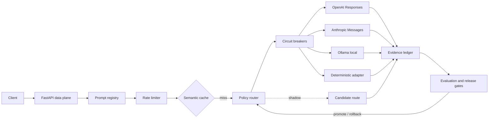

# Aegis AI Gateway

A production-oriented, policy-first multi-model gateway and evaluation control plane. Aegis routes
requests across OpenAI, Anthropic, Ollama, and deterministic local adapters only after checking
capability, privacy, region, context, latency, and cost contracts.

It is deliberately more than an API wrapper: every routing decision is measurable, every release is
bound to immutable artifacts, and every fallback is constrained by the original request contract.

## What it demonstrates

- **Multi-provider data plane:** current OpenAI Responses API, Anthropic Messages API, Ollama Chat
  API, and a deterministic provider for tests and offline development.
- **Constraint-first routing:** text, streaming, tools, vision, structured output, data
  classification, privacy mode, region, context window, p95 latency, and maximum cost.
- **Production resilience:** per-tenant token buckets, per-route circuit breakers, classified
  upstream errors, compatible fallback, bounded semantic cache, and mid-stream failure semantics.
- **Release safety:** immutable prompt/model/dataset/policy artifacts, stable canary assignment,
  shadow traffic, offline gates, live guardrails, promotion, and automated rollback.
- **Evaluation evidence:** schema compliance, task quality, TTFT, p99 latency, cost per successful
  request, routing regret, failover success, and rollback latency.
- **Operability:** Prometheus metrics, structured event logs, SQLite evidence ledger, health checks,
  a small control-plane console, Docker, Kubernetes, and CI.

## Architecture



The detailed topology, data contracts, and failure semantics are in
[docs/architecture.md](docs/architecture.md).

## Quick start

Requirements: Python 3.12+.

```bash
python3.12 -m venv .venv
. .venv/bin/activate
python -m pip install -e '.[dev]'
cp .env.example .env
python scripts/seed_demo.py
aegis --reload
```

The deterministic routes are enabled by default, so the complete system runs without credentials or
network access. Open <http://127.0.0.1:8000/docs> for the API and
<http://127.0.0.1:8000/console> for the control-plane view.

Generate a response:

```bash
curl -s http://127.0.0.1:8000/v1/generate \
  -H 'Content-Type: application/json' \
  -d '{
    "tenant_id": "demo",
    "messages": [{"role": "user", "content": "Explain circuit breakers briefly."}],
    "max_cost_usd": 0.02,
    "max_latency_ms": 5000
  }'
```

Stream normalized SSE events:

```bash
curl -N http://127.0.0.1:8000/v1/generate \
  -H 'Content-Type: application/json' \
  -d '{
    "tenant_id": "demo",
    "stream": true,
    "messages": [{"role": "user", "content": "Stream this response."}]
  }'
```

Use the OpenAI-compatible surface:

```bash
curl -s http://127.0.0.1:8000/v1/chat/completions \
  -H 'Content-Type: application/json' \
  -H 'X-Aegis-Tenant: demo' \
  -d '{"model":"auto","messages":[{"role":"user","content":"Hello"}]}'
```

## Enabling real providers

Credentials are read only from environment variables. Never place keys in `configs/models.yaml`.

1. Export `OPENAI_API_KEY` and/or `ANTHROPIC_API_KEY`.
2. Set the corresponding route's `enabled` field to `true` in `configs/models.yaml`.
3. Replace example model identifiers and prices with values verified for your account and region.
4. Run a small evaluation before creating a canary release.

The OpenAI adapter follows the official
[Responses streaming contract](https://developers.openai.com/api/docs/guides/streaming-responses)
and `text.format` JSON Schema contract. The Anthropic adapter follows the
[Messages streaming contract](https://platform.claude.com/docs/en/build-with-claude/streaming)
and `output_config.format` structured-output contract. Ollama uses its documented
[`/api/chat`](https://docs.ollama.com/api/chat) NDJSON interface.

## Release workflow

```text
register prompt/dataset/model artifacts
                 |
             offline eval
                 |
       deterministic release gate
                 |
          shadow + 5% canary
                 |
       live p99/error/schema checks
          /                  \
      promote           auto rollback
```

`scripts/seed_demo.py` creates an immutable evaluation dataset and a draft release. Control-plane
routes require `Authorization: Bearer $AEGIS_ADMIN_TOKEN`.

Run the deterministic benchmark:

```bash
python scripts/run_benchmark.py --requests 250 --concurrency 25
```

## Quality gates

```bash
make check
```

This runs Ruff, strict mypy, tests with branch coverage, a credential-pattern scan, and the local
benchmark smoke test. See [docs/evaluation.md](docs/evaluation.md) for metric definitions and
[docs/operations.md](docs/operations.md) for incident procedures.

## Security posture

- Cache identity includes tenant, data classification, privacy mode, schema, capabilities, prompt
  reference, and output budget.
- Confidential requests implicitly require zero-retention or local routes; restricted data requires
  local-only routes.
- Provider credentials are secret settings and never appear in route catalogs, responses, metrics,
  or logs.
- Fallback happens only among routes that independently satisfy the original contract.
- Once streaming output is exposed, Aegis reports interruption rather than silently switching models.

The demo data plane intentionally relies on an upstream identity layer. Before internet exposure,
follow the hardening checklist in [docs/security.md](docs/security.md).

## Repository map

```text
src/aegis_gateway/providers/  OpenAI, Anthropic, Ollama, and mock adapters
src/aegis_gateway/control/    routing, cache, resilience, registry, eval, releases
src/aegis_gateway/api/        native and OpenAI-compatible HTTP/SSE APIs
configs/                      model-route catalog
tests/                        unit, adapter-contract, API, and release tests
scripts/                      seeding, benchmark, and repository validation
deploy/kubernetes/            deployment, service, configuration, and network policy
docs/                         architecture, evaluation, security, and runbooks
```

## Honest scope

SQLite and the in-process limiter/cache make the repository reproducible on one laptop. A
multi-replica deployment should replace them with transactional PostgreSQL, Redis-backed distributed
rate limiting/cache, and a durable event bus. The interfaces and failure semantics are designed so
those substitutions do not change the public request contract.

## License

MIT
