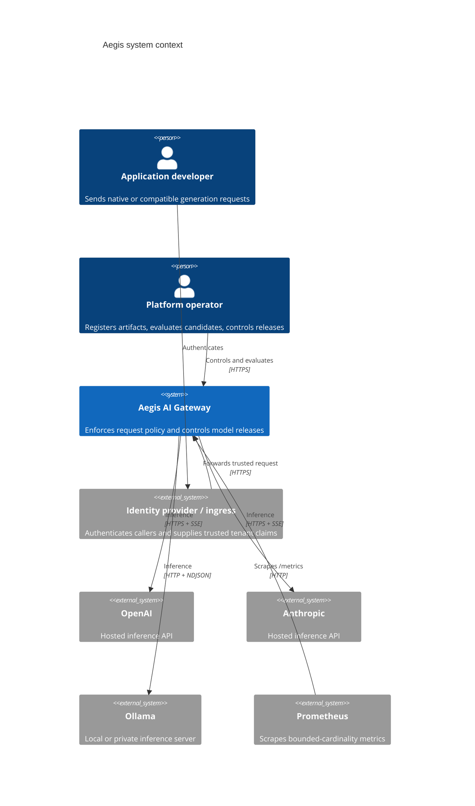
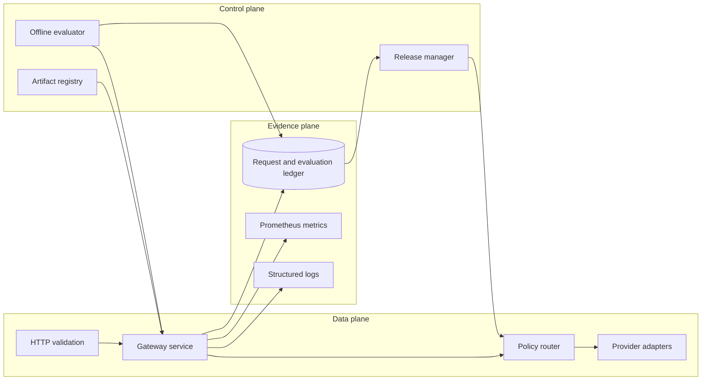
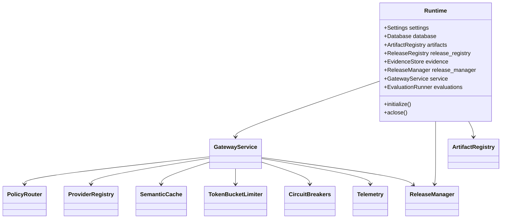
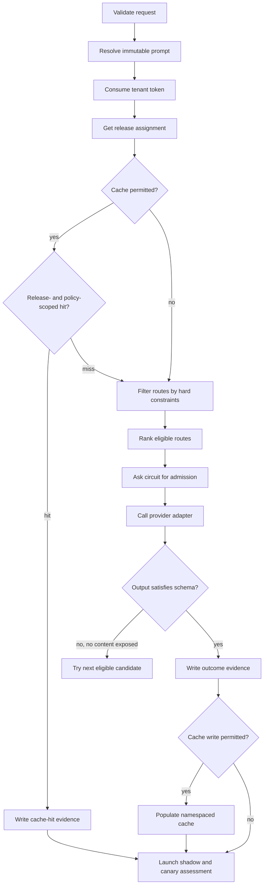
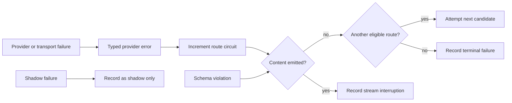
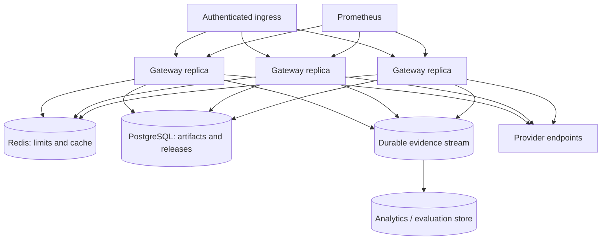

# Architecture and invariants

## The problem Aegis is solving

An application that calls one hosted model can choose a provider in configuration and retry on
failure. That approach stops working when different requests carry different legal, privacy,
capability, latency, context, and budget constraints. At that point, model selection becomes a
runtime policy decision with release risk of its own.

Aegis separates that decision from provider transport code. The request describes its contract;
route metadata describes what each provider/model deployment can satisfy; the router first finds the
feasible set and only then ranks it. Evaluation and release state sit beside the data plane so a
model change follows the same evidence path as an application release.

The code is organized around three questions:

1. Is this route allowed to process this request?
2. Among allowed routes, which one best serves the stated objective?
3. What evidence would justify keeping or reversing that decision?

## Context and trust boundary

The ingress/identity provider is shown because it is required in a public deployment, even though it
is not included in this repository. The reference API accepts `tenant_id` from the body to make local
testing simple. Treating that value as authoritative on the public internet would let a caller choose
another tenant's rate-limit and cache namespace.

Provider APIs are outside the trust boundary. A successful HTTP status does not make a model output
safe, schema-valid, or semantically correct. Status bodies, event frames, token counts, request IDs,
finish reasons, and model names are all normalized at the adapter boundary.

## Logical planes

The planes are logical responsibilities; the reference deployment runs them in one process.

### Data plane

The data plane validates caller input, resolves a prompt artifact, consumes tenant rate-limit
capacity, gets a release assignment, checks the release- and policy-scoped semantic cache, asks the
router for eligible candidates, invokes adapters, validates structured output, and records evidence.

Its primary interface is `GatewayService`. Provider SDK objects never leak into this class. The
service receives a `ProviderRegistry` whose values implement the same complete and streaming
protocols.

### Control plane

The control plane stores immutable artifacts, runs an evaluation dataset against a forced route,
creates releases, starts a canary, promotes it, or rolls it back. Control operations can affect future
traffic and therefore have a separate bearer check in the reference API.

The evaluator calls the same `GatewayService.generate` method as online traffic with three important
differences: the cache is bypassed, shadow traffic is disabled, and the route is forced. This keeps
provider parsing and schema enforcement identical while preventing online policy from contaminating
an offline comparison.

### Evidence plane

Every completed online attempt writes a `RequestMetric` row before live release assessment. Offline
evaluation runs are stored as complete JSON documents plus searchable identifiers. Prometheus
metrics serve operational alerting; SQLite evidence serves release decisions and forensic queries.
Those are different jobs. A dashboard counter may reset during a deployment; an evaluation or
rollback audit should not.

## Runtime composition

`create_runtime` is the composition root. It constructs state stores, adapters, routing policy,
release logic, telemetry, and orchestration in one place.

Centralizing construction has two practical benefits. First, a test can build the entire application
with a temporary database and deterministic adapter. Second, moving from SQLite and local memory to
PostgreSQL and Redis does not require changing API handlers or provider implementations.

## Component responsibilities

| Component | Owns | Deliberately does not own |
|---|---|---|
| API boundary | HTTP decoding, Pydantic validation, SSE encoding, admin authentication | Routing or provider-specific payloads |
| Gateway service | Online execution order, fallback, schema enforcement, evidence timing | Eligibility formulas or HTTP endpoint shape |
| Policy router | Hard constraints, predicted cost, utility, regret | Provider calls or retries |
| Provider adapter | Authentication headers, provider payloads, response/event normalization | Cross-provider routing policy |
| Semantic cache | Safe lookup identity, similarity search, TTL, bounded eviction | Durable truth or release evidence |
| Circuit breaker | Route-local failure admission and recovery probe | Tenant quotas or provider billing |
| Token bucket | Per-tenant admission rate and burst | Concurrency queues or global spend |
| Artifact registry | Immutable named/versioned content | Mutable working drafts |
| Release manager | Stable assignment, gate state, automated rollback | Model quality scoring itself |
| Evidence store | Durable request metrics and evaluation runs | Real-time metric aggregation |
| Telemetry | Prometheus observations and structured completion logs | High-cardinality prompt content |

## Request path and ordering

Ordering is part of the security model, not incidental plumbing.

Prompt resolution precedes cache lookup because the prompt version and rendered developer message
affect output. Rate limiting precedes lookup so a hot cache cannot become an unmetered endpoint.
Release assignment precedes lookup so baseline, canary, active, and forced-route traffic cannot
silently reuse the wrong lane's output. Eligibility precedes circuit admission so a route that
violates policy is never touched merely to discover that its circuit is healthy. Evidence precedes
release assessment so the request that crosses a rollback threshold is visible to the decision.

See [Request lifecycle](request-lifecycle.md) for complete and streaming sequence diagrams.

## State ownership and consistency

| State | Current owner | Required property | Multi-replica replacement |
|---|---|---|---|
| Route catalogue | YAML loaded at process start | Reviewed, parseable, duplicate-free | Signed config release or configuration service |
| Prompt/dataset/model/policy artifacts | SQLite | Immutable composite key | PostgreSQL with unique constraint and audit log |
| Release pointer | SQLite | Transactional state transition | PostgreSQL transaction / strongly consistent control store |
| Evaluation runs | SQLite JSON document | Durable and tied to artifact versions | Object store for bodies plus relational index |
| Request evidence | SQLite append-only rows | Written before assessment | Event log and warehouse, with idempotency key |
| Circuit state | Process memory | Fast per-route admission | Usually per-replica; optionally coordinated health service |
| Rate-limit buckets | Process memory | Atomic consume per tenant | Redis/Lua or purpose-built rate-limit service |
| Cache entries | Process memory | Tenant/policy isolation, bounded memory | Redis/vector index partitioned by policy scope |
| Prometheus counters | Process memory | Bounded labels | Scraped per replica and aggregated by Prometheus |

Not every local state object should become globally consistent. A circuit breaker protects a caller
from wasting time on a route observed as unhealthy by the current replica; coordinating it globally
can spread one replica's transient network fault to every replica. Release state, by contrast, must
not disagree across replicas for long enough to invalidate a canary percentage or rollback.

## Invariants enforced in code

### Hard constraints dominate

The router builds a rejection list for every route. A route enters the candidate set only if that
list remains empty. `preferred_route_id` changes the selection within the candidate set; it cannot
insert a rejected route. The same rule applies to canary and fallback.

### Data classification can strengthen privacy

`restricted` always requires `local_only`. `confidential` plus the default `standard` request mode is
upgraded to `zero_retention`. A caller may request a stronger mode directly but cannot use a weaker
one to override classification.

### Region matching is explicit

When a request supplies `allowed_regions`, at least one value must intersect the route's `regions`.
The string `global` is not a wildcard. Residency labels are deployment assertions and should be
specific enough to audit.

### Fallback preserves the original contract

Fallback iterates the already filtered and ranked candidates. It does not run a second, relaxed
policy. A structured, local-only, region-constrained request can fail rather than escape to an
incompatible hosted model. That is expected fail-closed behavior.

### Streaming provenance is stable

Before the first content delta, the service may try the next eligible route. Once a delta is exposed,
an upstream failure becomes `stream_interrupted`. Concatenating output from two models would hide
which system produced which text, invalidate schema assumptions, and make evaluation evidence
ambiguous.

### Cache identity includes policy

Similarity comparisons happen only after an exact scope match. The scope contains tenant,
classification, privacy mode, response schema hash, required capabilities, allowed regions, cost and
latency limits, output budget, temperature, and prompt reference. This is more conservative than a
prompt-only cache by design.

### Artifact versions cannot be overwritten

The registry canonicalizes JSON and hashes it. Re-registering identical content under the same key
is idempotent; different content under that key raises a conflict. Release and evaluation records can
therefore refer to a stable input.

## Failure containment

Provider failures, malformed structured output, and mid-stream interruptions are not collapsed into
one generic 500. Typed errors drive circuit state, client retry semantics, metrics, and runbooks.
Shadow failures never alter the user response, but dropping them would defeat the purpose of shadow
traffic, so they remain release-scoped evidence.

## Scaling the reference design

The first production boundary is usually the state layer, not the provider adapter.

A sensible migration order is:

1. Put trusted identity and per-tenant authorization in front of the API.
2. Move immutable artifacts and release state to PostgreSQL with explicit migrations.
3. Move rate limits to an atomic distributed implementation.
4. Add a shared cache only after its partition and erasure semantics are tested.
5. Publish request evidence to a durable stream and make the SQLite write an outbox or remove it.
6. Separate offline workers from latency-sensitive online replicas.
7. Add region-specific route catalogues and failover policy rather than stretching one global
   catalogue across legal boundaries.

The public `GatewayRequest`, `GatewayResponse`, provider protocol, and release/evidence domain models
can remain stable through these changes.

## Intentional non-goals

Aegis does not attempt to be a generic workflow engine, agent framework, prompt IDE, billing ledger,
or model-training system. Those concerns can consume or feed this gateway, but folding them into the
request path would enlarge the failure domain and make the routing invariants harder to audit.

The OpenAI-compatible endpoint covers the subset needed to demonstrate client migration. It is not a
claim of byte-for-byte compatibility with every field, tool call, audio event, image input, or legacy
behavior in the upstream API.
