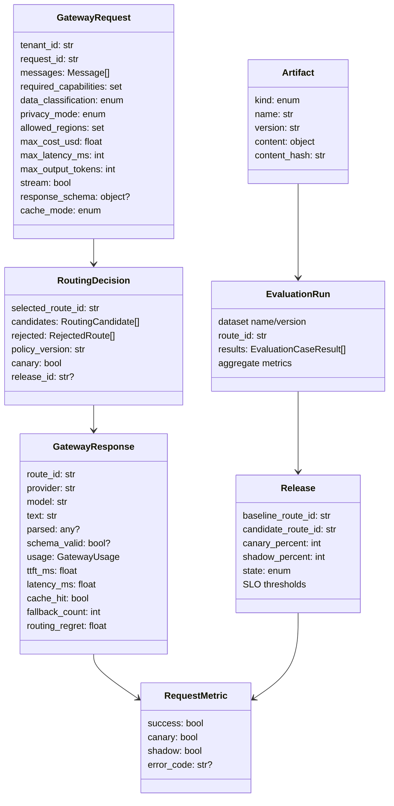
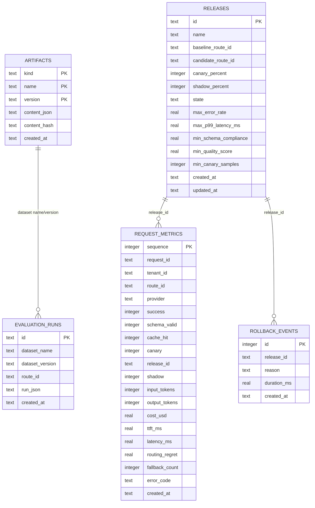
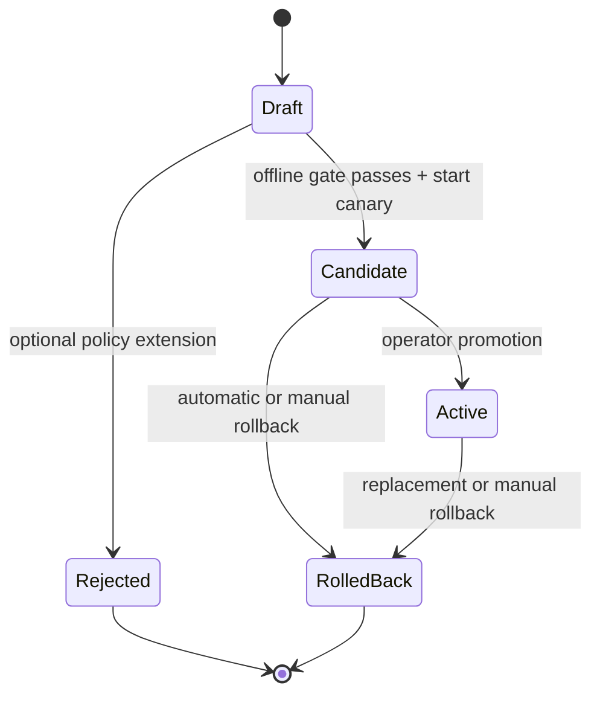

# Data model and persistence

Aegis uses Pydantic models at process boundaries and SQLite for durable control/evidence state. The
database is intentionally small enough to inspect, but its constraints encode important behavior:
artifact versions are immutable, release IDs are unique, and request evidence is append-only.

## Domain model

All public Pydantic models inherit `StrictModel`, whose `extra="forbid"` setting rejects unknown
fields. This is useful for API drift: a misspelled budget or privacy field fails instead of silently
using a default.

Models are mutable (`frozen=False`) because the request validator adds inferred capabilities and
some execution paths use `model_copy(update=...)`. Code should still treat instances crossing a
component boundary as value objects and prefer copies over in-place mutation.

## SQLite schema

The Mermaid relationships describe logical references. The reference schema does not declare all of
them as foreign keys. This permits evidence retention independent of release-row cleanup, but it also
means integrity must be checked by application logic or an offline audit.

SQLite is initialized with WAL mode and foreign keys enabled per initialization connection. Each
registry operation opens its own `aiosqlite` connection. Production code should set busy timeouts,
connection pragmas, and migration versioning explicitly on every connection.

## Artifact identity and immutability

Artifacts have a composite primary key:

\[
(kind, name, version)
\]

Supported kinds are `prompt`, `dataset`, `model_catalog`, and `policy`. Content is canonicalized with
sorted JSON keys and compact separators, then hashed:

\[
content\_hash = SHA256(canonical\_json(content))
\]

An insert collision follows two branches:

- same hash: return the existing artifact, making registration idempotent;
- different hash: raise `registry_conflict`.

No update method exists. A change requires a new version. This rule matters more than the hash
algorithm: release evidence is interpretable only if a referenced version cannot change after an
evaluation.

`get` without a version orders by creation time and returns the latest row. Creation time is not
semantic version ordering. Version `10` is not inferred to be newer than version `9`; latest means
most recently inserted.

## Release model

A release binds:

- a logical release name, defaulting to `default`;
- one baseline route ID;
- one candidate route ID;
- canary and shadow percentages;
- a state;
- live/evaluation thresholds for error rate, p99, schema compliance, quality, and minimum sample
  count.

States are `draft`, `candidate`, `active`, `rolled_back`, and `rejected`. The API currently exposes
create, start-canary, promote, assess, and rollback. `rejected` is modeled but not assigned by the
current endpoints; an evaluation gate failure leaves the release as a draft and returns a typed
error.

When a release becomes active, `set_state` rolls any other active release with the same name to
`rolled_back` in the same database transaction. Candidate and active rows are selected by
`get_live`, with candidate preferred. This lets a canary override the older active route during an
experiment.

The registry does not currently enforce allowed state transitions. An authorized caller can set a
draft directly to active through `ReleaseManager.promote`. The API's ordinary workflow provides
guardrails, but a production data layer should use compare-and-swap on expected state and encode a
transition table transactionally.

## Request evidence

`request_metrics.sequence` is an autoincrement key that preserves database insertion order. Each row
contains identifiers and numeric outcomes but not prompt or response text. That reduces accidental
content retention while preserving release and performance analysis.

Boolean values are stored as SQLite integers. `schema_valid` is nullable because unconstrained text
requests do not have a schema result. `release_id` is nullable for traffic outside a release.

Indexes support the current read paths:

- `created_at` for recent evidence;
- `(release_id, canary, created_at)` for live release assessment.

Route filtering is currently combined dynamically with these predicates. At high volume, add an
index based on actual query plans rather than indexing every label.

### Idempotency gap

`request_id` is not unique. A client retry or duplicate evidence write can create multiple rows.
This is useful when one logical request deliberately has multiple attempts, but the current table
stores only the final online result, not each attempt. A distributed evidence pipeline should add an
explicit event ID and idempotent consumer semantics.

## Metric aggregation

`EvidenceStore.summary` loads up to 100,000 rows into Python and computes:

- request and success counts;
- schema compliance over non-null schema results;
- cache-hit rate;
- failover success over rows with `fallback_count > 0`;
- mean cost per successful request;
- mean TTFT;
- nearest-rank p99 latency;
- mean routing regret.

This is appropriate for a laptop and tests. It is not an online analytical architecture. At scale,
use database/window aggregations or a metrics/analytics store, and define a time window explicitly.
The current live assessment has no age predicate, so all evidence for a release ID contributes.
Release IDs must therefore be unique per experiment.

## Evaluation storage

An evaluation run is stored twice conceptually:

- searchable columns identify run ID, dataset name/version, route, and creation time;
- `run_json` preserves the full validated `EvaluationRun`, including per-case results.

This avoids a large relational schema in the reference implementation. The trade-off is that per-tag
and per-case comparisons require loading JSON into Python. A production design might store raw
provider outputs in an encrypted object store, normalized case results in relational or columnar
tables, and immutable manifests connecting every object hash.

## Rollback events

Rollback rows record release ID, machine-readable reason text, state-transition duration, and time.
The API exposes the immediate `RollbackDecision`, but there is no list endpoint for rollback history.
Operators can query SQLite directly in the reference deployment; production should expose an
audited, read-only history.

## Transaction boundaries

Each artifact insert, release creation/state transition, metric write, evaluation write, and rollback
event is its own transaction. A rollback state update and rollback-event insert occur in separate
transactions. A crash between them can leave a rolled-back release without a corresponding event.

For stronger auditability, combine them in one transaction or use an outbox row written atomically
with the state transition. Similarly, promotion and replacement of the previous active release must
remain one atomic operation.

## Retention and privacy

The evidence table stores tenant and request IDs. Even without prompts, those can be personal or
commercially sensitive. Before production:

1. define retention by evidence purpose and tenant contract;
2. hash or tokenize external user identifiers before Aegis;
3. encrypt database volumes and backups;
4. separate operational metrics from long-lived evaluation evidence;
5. implement tenant and subject deletion indexes where required;
6. verify that rollback and audit retention does not conflict with deletion obligations;
7. keep prompt/response bodies out of routine logs.

## Migration to PostgreSQL

A compatible production schema should preserve:

- unique `(kind, name, version)` artifacts;
- canonical content hash and immutable rows;
- release transition concurrency control;
- append-only evidence with idempotent event keys;
- indexed release/canary/time queries;
- atomic rollback state plus audit event;
- UTC timestamp types rather than unconstrained text.

Use a migration tool and a schema version table. Run old and new application versions against the
same migration in CI. SQLite's permissive typing can hide assumptions that PostgreSQL rejects, so
test the target database rather than treating SQL compatibility as guaranteed.
