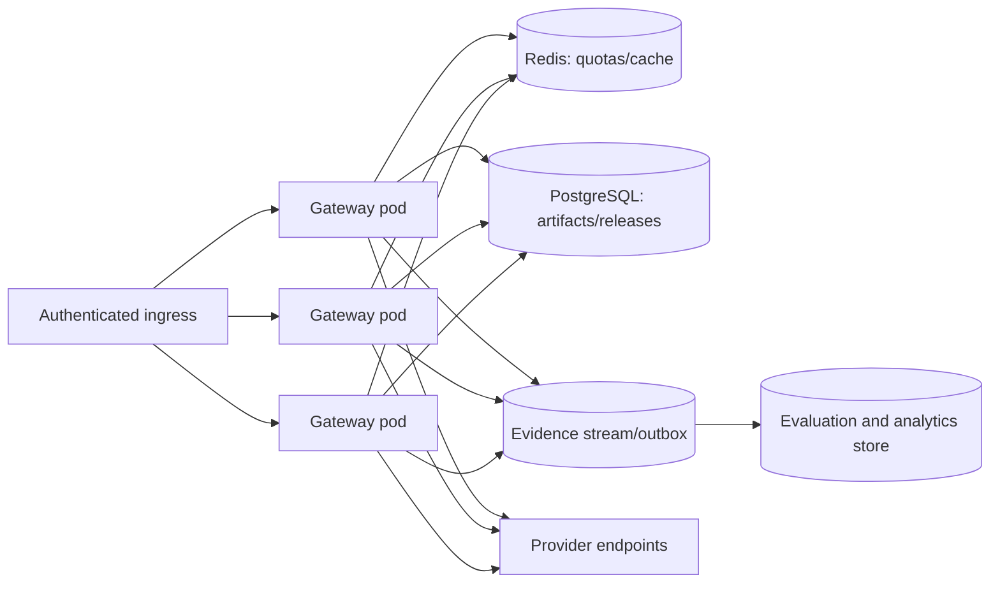

# Deployment guide

The repository supports three deployment shapes: a local Python process, Docker Compose, and a
single-replica Kubernetes reference. The latter is intentionally one replica because SQLite, the
semantic cache, rate limits, and circuit state are local to the process or pod.

## Configuration model

`Settings` reads environment variables with the `AEGIS_` prefix, except provider credentials which
use their standard names.

| Environment variable | Default | Purpose |
|---|---|---|
| `AEGIS_DATABASE_PATH` | `data/aegis.db` | SQLite registry/evidence path |
| `AEGIS_MODEL_CATALOG_PATH` | `configs/models.yaml` | Route catalogue loaded at startup |
| `AEGIS_OLLAMA_BASE_URL` | `http://localhost:11434` | Ollama API root |
| `AEGIS_OPENAI_BASE_URL` | `https://api.openai.com/v1` | OpenAI-compatible Responses root |
| `AEGIS_ANTHROPIC_BASE_URL` | `https://api.anthropic.com/v1` | Anthropic API root |
| `OPENAI_API_KEY` | unset | OpenAI provider credential |
| `ANTHROPIC_API_KEY` | unset | Anthropic provider credential |
| `AEGIS_ADMIN_TOKEN` | `development-only` | Reference control-plane bearer |
| `AEGIS_LOG_LEVEL` | `INFO` | Python logging level |
| `AEGIS_ENABLE_CONSOLE` | `true` | Enable the small browser console |
| `AEGIS_REQUEST_RATE_PER_SECOND` | `5` | Per-process, per-tenant refill rate |
| `AEGIS_REQUEST_BURST` | `20` | Per-process, per-tenant burst capacity |
| `AEGIS_CACHE_TTL_SECONDS` | `900` | Local response cache TTL |
| `AEGIS_CACHE_SIMILARITY_THRESHOLD` | `0.96` | Cosine threshold within an exact scope |
| `AEGIS_CIRCUIT_FAILURE_THRESHOLD` | `3` | Consecutive failures before open |
| `AEGIS_CIRCUIT_RECOVERY_SECONDS` | `30` | Open-to-half-open delay |
| `AEGIS_POLICY_VERSION` | `utility-v1` | Routing decision policy label |

`.env.example` is a local template. Do not populate and commit it. In deployed environments, use the
platform's secret mechanism or workload identity.

## Route catalogue

`configs/models.yaml` is loaded once when the runtime is created. Invalid routes or duplicate IDs
fail startup. A catalogue change therefore requires a process restart in the reference design.

Before enabling a route, verify:

- model/deployment ID exists for the account;
- adapter request fields are supported by that model;
- context window and capability declarations are accurate;
- processing region and privacy claims match contract and infrastructure;
- prices are current for the account/service tier;
- expected p95 comes from a representative measured window;
- quality score comes from the relevant dataset;
- provider quota covers user, fallback, shadow, and evaluation traffic.

The hosted routes are disabled by default. This is deliberate: cloning the repository should not
spend API credits or send prompts off the machine.

## Local Python deployment

Requirements: Python 3.12 or later.

```bash
python3.12 -m venv .venv
. .venv/bin/activate
python -m pip install -e '.[dev]'
cp .env.example .env
python scripts/seed_demo.py
aegis --host 127.0.0.1 --port 8000 --reload
```

The two deterministic routes are enabled, so no provider key or network access is required.

Verify:

```bash
curl -fsS http://127.0.0.1:8000/health/live
curl -fsS http://127.0.0.1:8000/health/ready
curl -fsS http://127.0.0.1:8000/metrics | head
```

`--reload` is for development. It creates a reloader process and should not be used in production.

## Enabling a hosted provider

Example for OpenAI:

```bash
export OPENAI_API_KEY='set-this-outside-source-control'
```

Then edit a reviewed route entry and set `enabled: true`. Start with a small forced offline
evaluation before allowing automatic routing. Do not print the environment or run a shell command
that expands the key into CI logs.

The provider `health` implementation for OpenAI and Anthropic reports whether a key is configured;
it does not make a paid or authenticated health request. Actual reachability appears when traffic or
a gated contract test calls the provider.

## Container image

Build locally:

```bash
docker build -t aegis-ai-gateway:0.1.0 .
docker run --rm -p 8000:8000 \
  -e AEGIS_ADMIN_TOKEN='replace-me' \
  -v aegis-data:/app/data \
  aegis-ai-gateway:0.1.0
```

The Dockerfile:

- uses a Python 3.12 slim base;
- installs the project from source;
- creates a non-root `aegis` user;
- exposes port 8000;
- stores SQLite under `/app/data`;
- includes an HTTP liveness check;
- runs Uvicorn without a development reloader.

For reproducible supply-chain controls, replace floating base image and dependency ranges with
reviewed digests/lock data in the release pipeline. Build an SBOM and sign the resulting image.

## Docker Compose

Start the gateway only:

```bash
AEGIS_ADMIN_TOKEN='replace-me' docker compose up --build gateway
```

Start the optional Ollama service as well:

```bash
AEGIS_ADMIN_TOKEN='replace-me' docker compose --profile local-model up --build
```

Compose persists SQLite and Ollama state in named volumes. The route catalogue still has
`ollama-local` disabled; enable and evaluate it after pulling the configured model into Ollama.

```bash
docker compose exec ollama ollama pull qwen3:8b
```

Model names and hardware requirements change. Treat this as an example and choose a model/quantization
that fits the host memory and evaluation target.

## Kubernetes reference

The manifests under `deploy/kubernetes` create:

- one `Deployment` replica;
- one cluster `Service`;
- a `ConfigMap` for non-secret settings;
- a default-deny-style ingress/egress `NetworkPolicy` with DNS and HTTPS egress;
- non-root, seccomp, dropped capabilities, no service-account token, and read-only root filesystem;
- writable `emptyDir` volumes for SQLite and `/tmp`.

The image reference is:

```text
ghcr.io/kevinmeix1/multi-model-ai-gateway:0.1.0
```

For a real release, publish the image and replace the tag with its immutable digest.

Create the secret separately:

```bash
kubectl create secret generic aegis-secrets \
  --from-literal=AEGIS_ADMIN_TOKEN='replace-me' \
  --from-literal=OPENAI_API_KEY='' \
  --from-literal=ANTHROPIC_API_KEY=''
```

This command places values in Kubernetes Secret storage, which is only base64 encoding unless the
cluster enables encryption at rest. Prefer an external secret controller or workload identity.

Apply:

```bash
kubectl apply -f deploy/kubernetes/configmap.yaml
kubectl apply -f deploy/kubernetes/service.yaml
kubectl apply -f deploy/kubernetes/network-policy.yaml
kubectl apply -f deploy/kubernetes/deployment.yaml
kubectl rollout status deployment/aegis-gateway
```

Do not use the included `emptyDir` for durable production artifacts/evidence. It disappears with the
pod. Mount an encrypted persistent volume for a single-replica deployment or move the durable stores
to PostgreSQL/object storage before scaling.

## Health endpoints

### `/health/live`

Returns `{"status":"alive"}` when the event loop can serve the request. It does not query providers
or SQLite. Use it for process restart decisions.

### `/health/ready`

Returns status, provider health observations, and enabled route IDs. It currently returns HTTP 200
even when optional providers are unhealthy. This keeps disabled or unused providers from removing the
gateway from service.

A deployment with mandatory routes should implement a readiness policy such as "at least one
eligible route for every critical traffic class" rather than requiring every configured provider to
be healthy.

## Network policy caveats

The manifest permits TCP 443 egress broadly and DNS to namespaces. Standard Kubernetes
`NetworkPolicy` cannot reliably allowlist SaaS domain names. A production cluster should add an
egress proxy/firewall with destination identity and prevent access to cloud metadata and internal
control services.

If Ollama runs inside the cluster, add a specific egress rule to its namespace/service port and
remove broad internal reachability. If no hosted provider is enabled, HTTPS egress can be removed.

## One replica versus many

Do not increase `replicas` while retaining the reference state assumptions. Multiple independent
replicas create:

- multiplied per-tenant burst/rate limits;
- inconsistent cache contents and invalidation;
- different circuit states;
- one SQLite database per `emptyDir` pod;
- conflicting release/evaluation views;
- shadow task loss during rolling updates.

The multi-replica topology is:



Migration checklist:

1. Externalize artifact/release/evidence state with migrations and transactional invariants.
2. Add distributed atomic request, concurrency, token, and spend limits.
3. Decide whether cache is shared; preserve exact scope and deletion semantics.
4. Keep circuits local unless global health coordination has a clear failure model.
5. Queue shadow/evaluation work separately from online traffic.
6. Add idempotent evidence events and reconcile duplicate delivery.
7. Implement release-state caching with bounded staleness and invalidation.
8. Load-test the shared dependencies and failure paths.

## Uvicorn workers

Running multiple Uvicorn workers in one pod has the same local-state problem as multiple replicas:
each worker has its own cache, limiter, circuits, and runtime, while they may contend on one SQLite
file. Keep one worker until state is externalized. Scale vertically or tune async connection limits
for the reference deployment.

## Capacity planning

For request arrival rate `\lambda`, mean complete service time `E[S]`, and streaming connection time
`E[S_stream]`, Little's Law gives approximate mean concurrency:

\[
L=\lambda E[S]
\]

Shadow traffic raises provider call rate by `\lambda(1-c)s`, where `c` is canary fraction and `s` is
shadow fraction among non-canary requests. Fallback raises it again according to route failure rate.

Size:

- HTTP connection pools for peak provider concurrency;
- file descriptors for inbound streams plus outbound provider streams;
- memory for request bodies, assembled stream text, cache values, and background tasks;
- provider requests/tokens per minute and spend;
- SQLite write throughput or external evidence pipeline;
- CPU for JSON Schema validation and semantic-cache scans.

## Rolling releases

Before a rolling deployment:

1. ensure schema/config changes are backward compatible;
2. stop or account for active canaries whose evidence spans versions;
3. make the old and new versions read the same release semantics;
4. mark pods unready before termination;
5. allow streams and evidence writes to drain;
6. verify route assignments and metric continuity after rollout.

Use an immutable image digest and include source commit, route catalogue version, policy version, and
artifact hashes in deployment metadata.

## Backup and recovery

For SQLite:

- place the service in a quiescent state or use SQLite's backup API;
- copy database, WAL as appropriate, and route catalogue;
- encrypt and test the backup;
- restore into an isolated environment;
- verify artifact hashes, release state, evaluation count, request rows, and rollback events.

A backup is not proven until a restore drill completes. For PostgreSQL, configure point-in-time
recovery and test application-level invariants after restore.

## Deployment acceptance checklist

- [ ] All CI checks pass for the exact source commit.
- [ ] Image digest, SBOM, and signature are recorded.
- [ ] Route catalogue assertions have owners and evidence.
- [ ] Provider credentials have minimum scope and spend limits.
- [ ] Identity derives tenant and authorized budgets.
- [ ] Control plane is network-isolated and uses scoped RBAC.
- [ ] Egress cannot reach metadata or unapproved internal services.
- [ ] Durable state and backups survive pod replacement.
- [ ] Rate, concurrency, token, and spend limits are tested.
- [ ] SSE works through the actual ingress without buffering.
- [ ] Dashboards and alert routing are live.
- [ ] Canary, promotion, rollback, and restore drills have been run.
