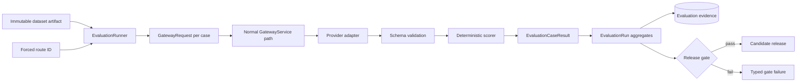
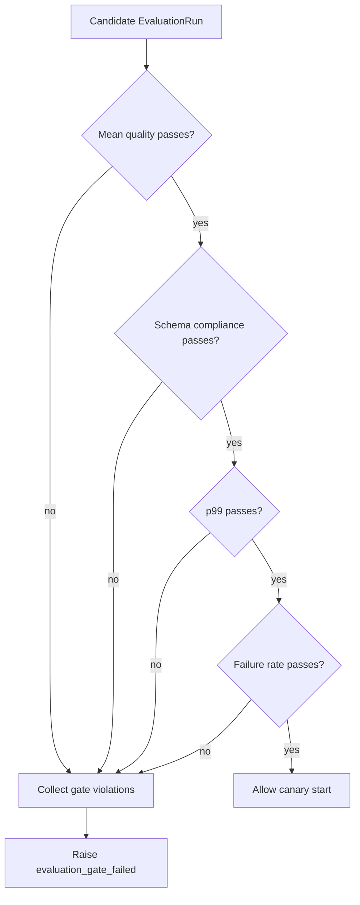

# Evaluation methodology

The evaluator answers a narrower question than "which model is best?" It asks whether one configured
route, under one immutable dataset and one scoring contract, clears explicit release thresholds. The
result is evidence for a decision, not a universal model ranking.

## Evaluation topology



Evaluation uses the normal provider normalization and schema-validation code. It changes execution
policy in four ways:

- forces the requested route;
- bypasses semantic cache;
- disables shadow traffic;
- skips online tenant rate limiting.

The forced route still has to satisfy request capabilities, context, privacy, latency, cost, and
circuit availability. Evaluation is not a policy bypass.

## Dataset contract

A dataset is an immutable artifact whose `content` contains a non-empty `cases` array:

```json
{
  "cases": [
    {
      "id": "ticket-routing-001",
      "messages": [
        {
          "role": "user",
          "content": "Route this ticket: I was charged twice for order 991."
        }
      ],
      "expected_contains": ["billing"],
      "tags": ["classification", "billing", "en-GB"]
    },
    {
      "id": "health-schema-001",
      "messages": [{"role": "user", "content": "Return service health."}],
      "response_schema": {
        "type": "object",
        "properties": {
          "status": {"type": "string", "enum": ["healthy", "degraded"]}
        },
        "required": ["status"],
        "additionalProperties": false
      },
      "tags": ["structured-output", "smoke"]
    }
  ]
}
```

An `EvaluationCase` supports:

| Field | Purpose |
|---|---|
| `id` | Stable case identity used for diffing and triage |
| `messages` | Complete normalized conversation |
| `expected_text` | Exact normalized output check |
| `expected_contains` | One or more required normalized substrings |
| `response_schema` | JSON Schema enforced by the gateway |
| `tags` | Task, language, risk, tenant archetype, or failure-domain labels |

Dataset versions should be content-reviewed like code. A change to a prompt, expected label, schema,
or case distribution creates a new artifact version.

## Current deterministic scorer

Text is case-folded, leading/trailing whitespace is removed, and runs of whitespace collapse to one
space. The scorer creates Boolean checks:

- one equality check when `expected_text` exists;
- one containment check for each `expected_contains` fragment;
- one non-empty-output check when neither expected form exists.

For `n` checks:

\[
quality(case,response)=\frac{1}{n}\sum_{i=1}^{n}\mathbb{1}[check_i\;passes]
\]

A case passes only when:

\[
quality=1.0 \quad \land \quad schema\_valid\neq false
\]

This is intentionally strict. If two required fragments are supplied and one is missing, quality is
0.5 and the case fails. Schema-only cases still get a non-empty text check.

Any exception becomes a failed case result with zero quality and the exception class name. The
runner continues with later cases so one route failure does not erase the rest of the diagnostic
sample.

### What this scorer can and cannot measure

It works for exact transforms, classifications represented by stable text, required facts, and
schema contracts. It cannot reliably score open-ended correctness, groundedness, style, safety,
multi-step tool use, or semantic equivalence.

Do not make expected substrings increasingly vague to improve pass rate. Add a task-specific
deterministic grader, calibrated model judge, executable assertion, retrieval citation check, or human
review path.

## Aggregate metrics

For `N` cases with pass indicator `p_i`, quality `q_i`, latency `l_i`, and cost `c_i`:

### Pass rate

\[
pass\_rate=\frac{1}{N}\sum_{i=1}^{N}p_i
\]

### Mean quality

\[
mean\_quality=\frac{1}{N}\sum_{i=1}^{N}q_i
\]

### Schema compliance

Let `S` be cases for which `schema_valid` is non-null:

\[
schema\_compliance=
\begin{cases}
\frac{1}{|S|}\sum_{i\in S}\mathbb{1}[schema_i=true], & |S|>0\\
null, & |S|=0
\end{cases}
\]

### Nearest-rank p99

For sorted latencies `l_(1) ... l_(N)`:

\[
p99=l_{(\lceil0.99N\rceil)}
\]

For a small dataset this often equals the maximum. Report sample count beside p99; a "p99" from ten
cases is not a tail estimate with production meaning.

### Total cost

\[
total\_cost=\sum_{i=1}^{N}c_i
\]

Cost uses provider token counts and route catalogue prices. Catalogue drift makes historical cost
comparisons misleading unless the price version is preserved with the run.

## Online evidence metrics

The evidence store computes the requested project metrics as follows:

| Metric | Definition | Interpretation |
|---|---|---|
| Schema compliance | Valid schema results / all non-null schema results | Output contract stability |
| Cost per successful request | Sum cost on successes / success count | Economic efficiency without cheap failures hiding spend |
| TTFT | Request start to first content delta | Perceived streaming responsiveness |
| p99 latency | Nearest-rank p99 end-to-end latency | Tail behavior in the selected evidence window |
| Routing regret | Utility(best eligible) − utility(selected) | Opportunity cost under configured policy |
| Failover success | Successful rows with fallback / all rows with fallback | Recovery effectiveness |
| Rollback time | Release-state update completion − rollback start | Mechanical mitigation speed |

These metrics detect different regressions. A candidate can have perfect schema compliance and poor
task quality, lower cost but worse p99, or strong mean quality with an unacceptable failure tail.

## Release gate

`enforce_release_gate` rejects a candidate when any configured condition is violated:

\[
mean\_quality < Q_{min}
\]

\[
schema\_compliance < S_{min}\quad\text{when schemas exist}
\]

\[
p99 > L_{max}
\]

\[
1-pass\_rate > E_{max}
\]

All failures are reported together. Fixing quality should not require another run merely to discover
that latency was also outside the release contract.



The gate currently evaluates only the candidate against absolute thresholds. A stronger release
review also compares candidate and baseline on paired cases and constrains regression even when both
clear a broad absolute floor.

## Paired baseline/candidate analysis

Run the same dataset version against both routes. For case `i`, compute paired differences:

\[
\Delta q_i=q_{candidate,i}-q_{baseline,i}
\]

\[
\Delta l_i=l_{candidate,i}-l_{baseline,i}
\]

\[
\Delta c_i=c_{candidate,i}-c_{baseline,i}
\]

Inspect the distribution and case IDs, not only means. A candidate that improves 95 routine cases
and breaks five safety-critical cases should not pass because average quality rose.

Useful release constraints include:

- no regression on `critical` tags;
- lower confidence bound of quality delta above an allowed margin;
- p95/p99 latency delta below a budget;
- maximum per-case cost increase;
- zero new schema failures;
- no new prompt-injection or data-exfiltration successes.

## Statistical confidence

For a Bernoulli pass rate `\hat{p}` over `n` independent cases, a rough standard error is:

\[
SE(\hat{p})=\sqrt{\frac{\hat{p}(1-\hat{p})}{n}}
\]

Near 99% pass rate, observing zero failures in 20 cases is weak evidence. Use Wilson intervals or a
Bayesian beta-binomial model rather than a normal approximation near boundaries.

For online canaries comparing two proportions with baseline `p_0`, target detectable difference
`\delta`, type-I error `\alpha`, and power `1-\beta`, a planning approximation is:

\[
n\approx
\frac{2p_0(1-p_0)(z_{1-\alpha/2}+z_{1-\beta})^2}{\delta^2}
\]

Traffic is rarely independent and identically distributed. Repeated users, task mix, time of day,
provider incidents, and cache state create correlation. Stratify and use sequential-test methods if
the rollout decision is repeatedly inspected.

The reference `min_canary_samples` is a mechanical floor, not a statistical power guarantee.

## Dataset construction

A useful dataset is a risk-weighted sample, not a random bag of prompts. Include:

- high-volume ordinary tasks;
- high-cost long-context requests;
- every supported schema family;
- multilingual and code-heavy inputs relevant to users;
- edge cases near context, cost, and latency limits;
- previously observed incidents;
- prompt-injection and data-exfiltration attempts;
- provider refusal and safety behavior;
- cases where exact wording should not matter;
- malformed or adversarial inputs expected to fail at the gateway boundary.

Tag cases so regressions can be localized. Aggregate pass rate without slices often hides that one
language, tenant archetype, or tool path is broken.

## Preventing evaluator leakage

1. Keep a final holdout unavailable to prompt and routing-policy authors.
2. Version grader prompts, judge models, rubrics, and decoding settings as artifacts.
3. Do not use one model judge as ground truth. Measure agreement with human labels by task slice.
4. Separate retrieval, tool execution, schema, safety, and final-answer scores.
5. Store enough provenance to reproduce adjudication without putting sensitive prompts in routine
   telemetry.
6. Track dataset changes and remove accidental duplicates across train/tune/holdout sets.
7. Investigate sudden universal improvements; they often indicate leakage or a weakened grader.

## Model-judge design

When deterministic checks are insufficient, a model judge should return a strict schema containing
score, rubric dimension results, and concise evidence. Randomize candidate order for pairwise judging
and measure position bias. Use multiple judge prompts or models on consequential tasks.

Calibrate with a human-labeled set and report confusion matrices, not just judge/human correlation.
A judge that gives similar average scores can still systematically miss unsafe false positives.

Judge calls have their own cost, latency, privacy, and provider dependencies. They belong in offline
workers, not the online request path.

## Reproducibility manifest

The current `EvaluationRun` records dataset name/version and route ID. A production manifest should
also pin:

- dataset content hash;
- prompt artifact name/version/hash;
- route catalogue and routing-policy version;
- exact provider model/deployment revision when available;
- adapter version and request payload schema;
- grader version and judge model;
- random seed and decoding settings;
- execution region and time window;
- price table version;
- source commit and container digest.

Without this manifest, "rerun the evaluation" can mean a materially different experiment.

## Triage workflow

When a candidate fails:

1. Split infrastructure errors from completed but low-quality cases.
2. Compare failed case IDs and tags with baseline.
3. Inspect schema errors separately from text-quality errors.
4. Check whether model, prompt, adapter, or dataset changed.
5. Reproduce one case with cache bypass and the forced route.
6. Verify provider request/response contract using redacted traces.
7. Add a deterministic assertion for any newly understood failure.
8. Run the full immutable dataset again; do not mutate expected output in place.

## Example API workflow

Register a dataset:

```bash
curl -sS -X POST http://127.0.0.1:8000/v1/control/artifacts \
  -H "Authorization: Bearer $AEGIS_ADMIN_TOKEN" \
  -H 'Content-Type: application/json' \
  --data @dataset-artifact.json
```

Run one route:

```bash
curl -sS -X POST http://127.0.0.1:8000/v1/control/evaluations \
  -H "Authorization: Bearer $AEGIS_ADMIN_TOKEN" \
  -H 'Content-Type: application/json' \
  -d '{
    "dataset_name": "gateway-smoke",
    "dataset_version": "1.0.0",
    "route_id": "mock-canary"
  }'
```

`scripts/seed_demo.py` registers a small deterministic dataset and draft release. It exists to prove
the workflow, not to establish a meaningful quality bar for real models.
