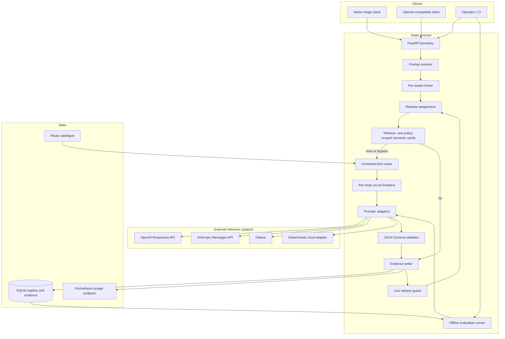

# Aegis engineering handbook

This handbook describes the system that exists in this repository. It is not a catalogue of
features a hypothetical gateway might eventually have. When a section discusses a future scaling
path, it labels that path explicitly and explains which current interface would change.

Aegis is a policy-first inference gateway with an evaluation and release control plane. The central
design decision is that provider selection is a constrained optimization problem. Availability is
only one constraint. A route also has to satisfy the caller's capability, privacy, residency,
context, latency, and cost contract before it can compete on quality or price.

## Choose a reading path

If you are evaluating the project as an engineer or hiring manager, read these first:

1. [Architecture and invariants](architecture.md) — boundaries, components, state, and explicit
   non-goals.
2. [Request lifecycle](request-lifecycle.md) — exact non-streaming, streaming, fallback, cache, and
   shadow execution paths.
3. [Routing policy](routing-policy.md) — hard constraints, utility ranking, cost prediction, and
   routing regret.
4. [Evaluation methodology](evaluation.md) — offline evidence, release gates, metrics, and the
   limits of automated scoring.
5. [Release engineering](release-engineering.md) — deterministic canaries, shadow traffic,
   promotion, and rollback.

If you are integrating a client or another provider:

- [API reference](api-reference.md)
- [Provider adapter contract](provider-adapters.md)
- [Semantic cache](semantic-cache.md)
- [Data model and persistence](data-model.md)

If you are deploying or operating the service:

- [Reliability model](reliability.md)
- [Observability](observability.md)
- [Performance and cost](performance-and-cost.md)
- [Security and privacy threat model](security.md)
- [Deployment guide](deployment.md)
- [Operations runbook](operations.md)
- [Test strategy](testing.md)

The [architecture decision records](decisions/README.md) capture choices that are easy to lose when
only the final code is visible.

## System map

## What runs today

The repository includes:

- a native `POST /v1/generate` API and a deliberately narrow OpenAI-compatible chat-completions
  surface;
- adapters for the OpenAI Responses API, Anthropic Messages API, Ollama chat API, and a deterministic
  local test provider;
- normalized complete-response and streaming contracts;
- hard policy filters followed by explicit utility scoring;
- tenant-scoped token buckets, route-scoped circuit breakers, and compatible fallback;
- a bounded semantic response cache whose identity includes policy-relevant request fields;
- immutable prompt, dataset, model-catalogue, and policy artifacts;
- deterministic shadow/canary allocation and evidence-driven rollback;
- JSON Schema enforcement, request evidence in SQLite, structured logs, and Prometheus metrics;
- Docker, Compose, Kubernetes manifests, and a CI workflow;
- an offline test path with no provider keys and no network dependency.

The deterministic adapter is not a toy stub hidden from the architecture. It is a first-class
provider used to test routing, caching, streaming, schema validation, fallback, release assignment,
and telemetry without making a paid network call.

## What does not run today

The current implementation is a strong single-process reference, not a claim of turnkey global
infrastructure. In particular:

- SQLite serializes the control-plane state on one host. It is not a multi-region consensus layer.
- Cache entries, circuit state, and token buckets live in one process. Multiple replicas would not
  share those decisions.
- The public data plane trusts the submitted `tenant_id`; an ingress identity layer must replace
  that before internet exposure.
- The control plane uses one bearer token rather than scoped RBAC.
- Tool calling and image inputs are route capabilities but do not yet have normalized public
  request contracts.
- Pricing and quality values in `configs/models.yaml` are examples. They are not fetched from
  providers and should not be treated as current prices.
- Automated rollback uses threshold rules. It does not establish statistical significance or
  causal attribution.

These limits are intentional. The code keeps provider adaptation, routing, evidence, and release
decisions behind interfaces so the local state components can be replaced without changing client
contracts.

## Core invariants

An implementation change is incorrect if it breaks any of the following:

1. **Hard policy before preference.** An ineligible route cannot be rescued by a high quality score,
   low price, preferred-route hint, canary assignment, or fallback position.
2. **No cross-policy cache reuse.** A cache hit must come from the same tenant and the same relevant
   privacy, residency, capability, schema, latency, cost, generation, and prompt scope.
3. **No hidden mid-stream model switch.** Fallback is allowed before content is emitted. After a
   content delta reaches the caller, an upstream failure terminates the stream with typed provenance.
4. **Artifact versions are immutable.** Reusing a `(kind, name, version)` key with different content
   is a conflict, not an update.
5. **A canary without evidence is unsafe.** User-visible and shadow outcomes are written separately;
   rollback reads the durable evidence store rather than transient dashboard values.
6. **Provider details stop at the adapter boundary.** Provider status codes and event shapes are
   converted into Aegis results and typed errors before entering routing or release logic.

## Source map

| Concern | Primary implementation |
|---|---|
| HTTP contracts and SSE encoding | `src/aegis_gateway/api/app.py` |
| Domain contracts | `src/aegis_gateway/domain.py` |
| Route configuration | `src/aegis_gateway/config.py`, `configs/models.yaml` |
| Online orchestration | `src/aegis_gateway/control/service.py` |
| Eligibility and ranking | `src/aegis_gateway/control/router.py` |
| Semantic cache | `src/aegis_gateway/control/cache.py` |
| Rate limiting and circuits | `src/aegis_gateway/control/rate_limit.py`, `circuit_breaker.py` |
| Artifacts, releases, evidence | `src/aegis_gateway/control/registry.py` |
| Canary and rollback policy | `src/aegis_gateway/control/release.py` |
| Offline evaluation | `src/aegis_gateway/control/evaluation.py` |
| Provider normalization | `src/aegis_gateway/providers/` |
| Metrics and logs | `src/aegis_gateway/control/telemetry.py` |
| Composition and lifecycle | `src/aegis_gateway/runtime.py` |

## Documentation conventions

Words such as *must* and *never* describe an invariant or required production control. *Should*
describes a strong default that can be changed with evidence. Latency values are end-to-end unless a
section labels them as gateway-only or provider-only. Costs are estimates based on provider-reported
token counts and catalogue prices; they are not billing records.

All diagrams are Mermaid so they render directly on GitHub and remain reviewable as text.
