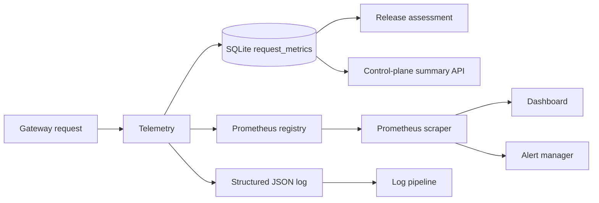
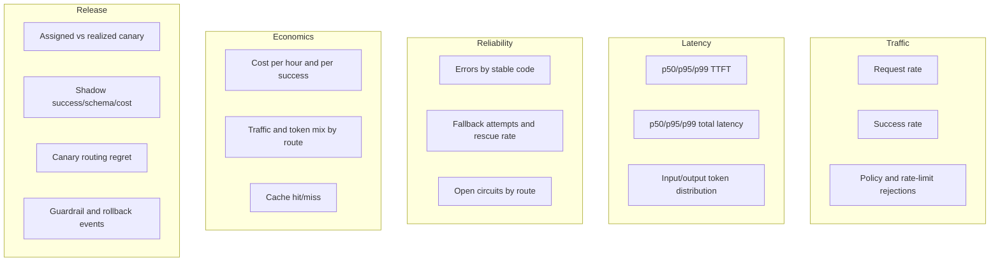

# Observability

A gateway sits between callers and several external systems, so one latency number is rarely enough
to diagnose a regression. Aegis currently provides durable request evidence, Prometheus metrics, and
structured completion events. This document defines what each signal means and where the reference
implementation still needs richer tracing.

## Signal architecture



The SQLite row is release evidence. Prometheus is for time-series operations. Logs are for
request-level correlation. They overlap intentionally but should not be treated as interchangeable.

## Durable request evidence

One terminal online outcome records:

- request and tenant IDs;
- final route and provider;
- success and schema result;
- cache, canary, release, and shadow labels;
- input/output tokens and estimated cost;
- TTFT and end-to-end latency;
- routing regret and fallback count;
- typed error code;
- UTC completion timestamp.

Prompt and response text are absent. That reduces content exposure but limits forensic debugging. A
production trace store can retain sampled/redacted payload hashes or encrypted payloads under a
separate retention policy.

## Prometheus instruments

`Telemetry` owns a private `CollectorRegistry` and exposes it at `GET /metrics`.

### Request counter

```text
aegis_requests_total{provider,route,outcome,canary,shadow}
```

`outcome` is `success`, a stable error code, or `error`. Provider and route come from bounded
configuration. Canary and shadow are string booleans.

Example request success rate over five minutes:

```promql
sum(rate(aegis_requests_total{outcome="success",shadow="false"}[5m]))
/
sum(rate(aegis_requests_total{shadow="false"}[5m]))
```

Do not include `request_id`, `tenant_id`, model output, schema name, or exception text as Prometheus
labels. Their cardinality can exhaust collector and query memory.

### End-to-end latency

```text
aegis_request_latency_seconds_bucket{provider,route,le}
aegis_request_latency_seconds_sum{provider,route}
aegis_request_latency_seconds_count{provider,route}
```

Histogram buckets range from 10 ms to 60 seconds. Approximate fleet p99 by route:

```promql
histogram_quantile(
  0.99,
  sum by (route, le) (rate(aegis_request_latency_seconds_bucket[10m]))
)
```

Histograms estimate quantiles from bucket boundaries. The SQLite summary uses exact nearest-rank over
the loaded rows, so the two p99 values can differ.

### Time to first token

```text
aegis_ttft_seconds_bucket{provider,route,le}
```

The same histogram aggregation applies. For non-streaming calls, TTFT equals complete response time;
split dashboards by endpoint/stream mode before interpreting it as model first-token latency. Stream
mode is not currently a Prometheus label, so adding a bounded `mode=complete|stream` label would make
this distinction operationally useful.

### Cost

```text
aegis_cost_usd_total{provider,route}
```

Estimated cost rate:

```promql
sum by (provider, route) (rate(aegis_cost_usd_total[1h])) * 3600
```

Cost per successful request over one hour:

```promql
sum(increase(aegis_cost_usd_total[1h]))
/
sum(increase(aegis_requests_total{outcome="success"}[1h]))
```

This is based on route catalogue prices and provider-reported tokens. It is not an invoice.

### Tokens

```text
aegis_tokens_total{provider,route,direction="input|output"}
```

Output/input ratio is a useful early signal for prompt or generation changes:

```promql
sum(rate(aegis_tokens_total{direction="output"}[15m]))
/
sum(rate(aegis_tokens_total{direction="input"}[15m]))
```

### Cache hits

```text
aegis_cache_hits_total
```

The reference metric has no tenant or route labels. Cache-hit rate is easier to compute from durable
evidence because the Prometheus surface does not publish an explicit lookup/miss counter. Add
`aegis_cache_lookups_total{outcome="hit|miss"}` before building a live hit-rate alert.

### Circuit state

```text
aegis_circuit_state{route}
```

The gauge uses `closed=0`, `half_open=1`, `open=2`. The service updates it on route admission,
provider success, provider failure, and a circuit rejection that races with routing. The
authenticated `/v1/control/circuits` endpoint remains the exact state view: an idle circuit's
time-based `open` to `half_open` transition is reflected in the gauge when the next request touches
that route, not at the instant the recovery timer elapses.

## Structured completion log

Every recorded metric produces one JSON event through logger `aegis.request`:

```json
{
  "event": "gateway_request_completed",
  "request_id": "request-1234",
  "tenant_id": "tenant-a",
  "route_id": "mock-primary",
  "provider": "mock",
  "success": true,
  "schema_valid": null,
  "cache_hit": false,
  "canary": false,
  "release_id": null,
  "shadow": false,
  "input_tokens": 12,
  "output_tokens": 10,
  "cost_usd": 0.0,
  "ttft_ms": 1.4,
  "latency_ms": 3.1,
  "routing_regret": 0.0,
  "fallback_count": 0,
  "error_code": null,
  "created_at": "2026-09-04T12:00:00Z"
}
```

Route-attempt failures also emit events such as `route_provider_failure` and
`route_schema_failure`. The helper removes attribute names containing `key`, reducing the risk of
accidentally logging an API key. This is a last line of defense, not a substitute for an allowlist.
Production logging should define permitted fields rather than accepting arbitrary attributes.

Tenant and request IDs may still be sensitive. Tokenize them at ingress or configure the log sink
with appropriate access and retention.

## Metric definitions and denominators

The denominator is where many gateway dashboards go wrong.

### Schema compliance

Only rows with non-null `schema_valid` count:

\[
schema\_compliance = \frac{valid\ schema\ rows}{all\ schema\ rows}
\]

Plain text requests neither pass nor fail schema.

### Failover success

Only rows with `fallback_count > 0` count:

\[
failover\_success = \frac{successful\ fallback\ rows}{all\ fallback\ rows}
\]

This metric says whether fallback rescued a degraded request. It does not measure how often the
first route fails.

### Cost per success

The reference summary sums cost only on successful final rows:

\[
mean\ cost\ per\ success=
\frac{\sum_{i:success_i}cost_i}{|successes|}
\]

Failed upstream attempts before a successful fallback are not separately metered, so duplicated
provider spend can be understated. Per-attempt evidence is a useful next schema revision.

### Routing regret

Regret is the utility gap at decision time. It uses configured priors, not realized quality. Trend it
when canary or external preferences are active, and recalibrate the inputs when regret disagrees with
measured outcomes.

## Suggested dashboard



Every panel should support route/provider and release filters. Tenant-level dashboards belong in a
system designed for that cardinality, not as unbounded Prometheus labels.

## Initial alerts

Use these as starting logic, not copied thresholds:

### Availability burn

Alert on multi-window error-budget burn rather than one threshold. For a 99.9% target, combine a fast
window that catches severe outages with a slower window that catches sustained degradation. Exclude
shadow rows from user availability.

### Provider route failures

```promql
sum by (route, outcome) (
  rate(aegis_requests_total{outcome!="success",shadow="false"}[5m])
) > 0
```

Add a minimum traffic floor and ratio condition to avoid paging on one low-volume failure.

### Tail latency

```promql
histogram_quantile(
  0.99,
  sum by (route, le) (rate(aegis_request_latency_seconds_bucket[10m]))
) > ROUTE_SLO_SECONDS
```

### Cost acceleration

Compare current cost rate with the same route's recent baseline and token mix. A raw dollar threshold
without traffic normalization pages during legitimate growth.

### Schema regression

The current Prometheus counters do not carry schema validity. Use the evidence summary API or add a
bounded `aegis_schema_results_total{route,result}` counter before alerting in Prometheus.

## Distributed tracing plan

The code has telemetry hooks but not OpenTelemetry spans. A useful trace should include:

```text
gateway.request
├── prompt.resolve
├── rate_limit.consume
├── cache.lookup
├── release.assign
├── routing.decide
│   └── routing.reject (events, bounded reasons)
├── provider.attempt route=...
│   ├── http.connect
│   ├── provider.ttft
│   └── provider.stream
├── schema.validate
├── evidence.write
└── shadow.enqueue
```

Recommended low-cardinality attributes:

- route ID, provider, policy version;
- data classification and privacy mode;
- stream/cache/canary/shadow booleans;
- input/output token buckets rather than exact prompt length where cardinality matters;
- error code and fallback index;
- schema present/valid;
- release ID only if release count is bounded in the trace backend.

Do not attach full prompts, outputs, API keys, authorization headers, or raw provider error bodies by
default. Sampling and redaction happen before export, not after data has reached a vendor.

## Correlation

`request_id` links API responses, structured logs, shadow IDs, evidence rows, and provider metadata
where supported. The gateway currently accepts caller-supplied IDs that satisfy length constraints.
At a trust boundary, distinguish a gateway trace ID from a caller idempotency/correlation ID so an
attacker cannot create misleading collisions.

## Observability failure

Prometheus observation is in-process and should not fail under normal use. Durable evidence writes can
fail due to disk or database faults. The current request path fails if it cannot record evidence. This
protects canary integrity at the cost of availability.

A production design should make that trade explicit with a durable local outbox. If evidence is
temporarily unavailable, either reject canary traffic or route it to baseline; do not continue a
candidate rollout with an unknown denominator.

## Verification checklist

- Generate one complete and one streaming request; verify counters and histograms move.
- Generate a cache hit; verify zero provider token/cost evidence and the cache counter.
- Inject a route-scoped mock outage; verify fallback count and rescue rate.
- Run a schema request; verify nullable versus true schema fields.
- Start a shadow release; verify user and shadow rows have the same release ID and distinct shadow
  flags.
- Trigger rollback thresholds; verify release state, reason, and rollback duration.
- Confirm no prompt, output, authorization header, or provider key appears in default logs.
