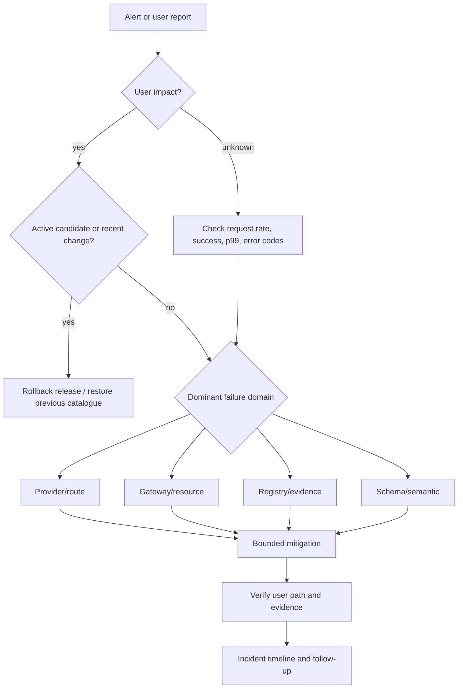

# Operations and incident runbook

This runbook assumes the operator can read gateway metrics/evidence, inspect deployment logs, and
change release or route configuration through a reviewed path. Commands use the local endpoint;
replace it with the environment URL.

## Initial service objectives

These are starting targets for the deterministic reference deployment, not measured claims for a
hosted model:

| Objective | Initial target | Measurement boundary |
|---|---:|---|
| Gateway availability | 99.9% | User traffic, excluding invalid/policy-rejected requests |
| Structured-output compliance | ≥99% | Requests with a response schema |
| Gateway overhead | p99 <50 ms | Excludes provider generation time |
| Automatic rollback state update | <1 s | Assessment decision to registry update |
| Cross-tenant cache disclosure | 0 | Security invariant, not an error budget |

Define provider/model SLOs separately. The gateway cannot promise lower end-to-end latency or higher
availability than the eligible route set and its shared dependencies permit.

## Incident decision flow



Prefer reversible mitigation. Do not widen privacy, region, capability, or cost policy to make an
error graph look better.

## First five minutes

1. Record incident start time, environment, reporter, and recent deployments/releases.
2. Check liveness, readiness, request rate, success rate, p99, TTFT, and dominant error codes.
3. Separate user traffic from shadow/evaluation traffic.
4. Filter evidence by active release and route.
5. If a recent candidate correlates with impact, roll it back before deep diagnosis.
6. Confirm at least one route remains eligible for critical privacy/region classes.
7. Preserve logs and evidence needed for a timeline; do not copy raw secrets or prompts into chat.

Useful calls:

```bash
curl -fsS http://127.0.0.1:8000/health/live
curl -fsS http://127.0.0.1:8000/health/ready

curl -sS http://127.0.0.1:8000/v1/control/metrics/summary \
  -H "Authorization: Bearer $AEGIS_ADMIN_TOKEN"

curl -sS 'http://127.0.0.1:8000/v1/control/metrics/recent?limit=50' \
  -H "Authorization: Bearer $AEGIS_ADMIN_TOKEN"

curl -sS http://127.0.0.1:8000/v1/control/circuits \
  -H "Authorization: Bearer $AEGIS_ADMIN_TOKEN"

curl -sS http://127.0.0.1:8000/v1/control/releases \
  -H "Authorization: Bearer $AEGIS_ADMIN_TOKEN"
```

## Provider or route outage

### Signals

- `provider_unavailable`, `provider_timeout`, or `provider_transport_error` rises;
- a route circuit opens;
- fallback count rises;
- latency rises before success because first attempts fail;
- provider status or quota dashboard reports an incident.

### Triage

1. Group failures by route and provider; avoid assuming every route at one provider shares a cause.
2. Check authentication errors separately from rate limits and 5xx.
3. Verify DNS, TLS, proxy, and egress from the gateway environment.
4. Confirm provider quota and spend limits.
5. Compare complete and streaming behavior; proxy buffering can look like provider TTFT.
6. Confirm the original request class has a compatible fallback.
7. Let one half-open probe test recovery; do not force a traffic stampede through an open circuit.

### Mitigation

- Roll back a recent route/model/catalogue change.
- Disable the affected route in a reviewed catalogue deployment if recovery is not imminent.
- Reduce shadow/evaluation load before reducing user traffic.
- Coordinate quota changes with spend controls.
- Keep hard policy intact; failing closed for a restricted request is correct if no local route works.

Do not increase retries globally. Nested retry layers amplify load and consume the client deadline.

### Verification

- circuit returns to closed after a successful probe;
- first-attempt success recovers, not only final success;
- p99 and cost per success return to baseline;
- provider error rate remains stable for at least one relevant traffic window.

## Provider authentication failure

### Signals

`provider_auth_error` appears immediately and consistently for one adapter/account.

### Triage and mitigation

1. Verify which environment and route use the credential without printing it.
2. Check secret mount/reference, key status, account/project scope, and recent rotation.
3. Revoke any credential suspected of exposure.
4. Issue a minimum-scope replacement and update the secret manager.
5. Restart or reload according to deployment secret behavior.
6. Run one gated contract request, then observe ordinary traffic.

Do not paste keys into issues, logs, shell transcripts, or control-plane artifacts.

## Rate-limit or quota exhaustion

Distinguish:

- gateway `rate_limit_exceeded` (client/tenant admission);
- provider `provider_rate_limited` (upstream quota/capacity);
- spend cap (provider account or internal budget);
- concurrency saturation (not explicitly modeled by the current limiter).

For tenant admission, confirm the tenant identity is trusted and measure request burst. For provider
limits, inspect calls/tokens per minute, fallback duplication, shadow percentage, and evaluation
workers. A traffic rate within QPS can still exceed token limits with longer prompts.

Mitigate in this order:

1. pause/lower shadow and offline evaluation;
2. remove accidental retries or duplicate callers;
3. reduce output limits for non-critical traffic;
4. shift only to routes that satisfy the original contract;
5. raise quota with an explicit cost decision;
6. shed low-priority traffic with a clear retry window.

## No eligible route

### Signals

Client receives `no_eligible_route` with per-route rejection reasons.

### Diagnostic order

1. Confirm required capabilities inferred from stream/schema fields.
2. Check effective privacy after data-classification upgrade.
3. Check explicit region intersection; `global` is not a wildcard.
4. Compare estimated input plus max output with context windows.
5. Compare worst-case predicted cost with caller budget.
6. Compare route expected p95 with latency budget.
7. Check enabled flags and circuit state.
8. For a forced route, verify the caller supplied an Aegis route ID rather than a raw model name.

Do not solve the incident by editing the request classification or widening route declarations
without evidence. If the caller budget is genuinely wrong, change it at the authorized application
policy layer.

## Schema regression

### Signals

- `schema_violation` rises while provider HTTP success remains normal;
- candidate schema compliance falls;
- structured requests fall back more often;
- only one schema family or model revision fails.

### Triage

1. Filter by route, release, and time.
2. Compare the exact schema, schema name, prompt version, adapter version, and model revision.
3. Re-run failed case IDs with cache bypass and forced baseline/candidate routes.
4. Confirm the route declares and actually supports native structured output.
5. Inspect whether a refusal or safety response is being treated as ordinary text.
6. Check streaming separately; final validation occurs after deltas were exposed.

### Mitigation

- Roll back the candidate or prompt.
- Use non-streaming for consumers that cannot tolerate optimistic fragments.
- Tighten or simplify unsupported schema features only through a new artifact version.
- Add every understood malformed output pattern to the regression dataset.

Do not silently parse "almost JSON" with regex or repair code unless that behavior is an explicit,
tested contract. Repair can turn a refusal or truncation into a plausible but wrong object.

## Tail-latency regression

### Signals

- p50 stable while p99 rises;
- TTFT rises but output generation duration does not;
- total latency rises with token count;
- fallback rate rises;
- SQLite writes or semantic-cache scans consume more time.

### Triage

Break latency into:

```text
ingress + queue + prompt lookup + cache + routing +
provider connect + provider queue/TTFT + generation +
schema validation + evidence write + response flush
```

The reference does not expose all of these spans, so correlate provider, gateway, database, and
proxy observations. Compare input/output token distributions before blaming a route. Check event-loop
lag, connection pool saturation, DNS, TLS reuse, file descriptors, memory pressure, and proxy SSE
buffering.

### Mitigation

- roll back a route with a measured regression;
- reduce output budget or long-context traffic where product policy permits;
- bound concurrency and queue depth;
- pause shadow/evaluation load;
- repair connection pooling or database contention;
- fail quickly when the remaining caller deadline cannot fit a fallback.

Increasing the caller timeout hides symptoms and can increase queue occupancy.

## Cost spike

### Triage

1. Inspect cost per successful request, not total cost alone.
2. Split by route/provider and input/output direction.
3. Check traffic volume, prompt length, output length, route mix, and fallback count.
4. Confirm shadow and offline evaluation volume.
5. Verify catalogue prices against current account billing.
6. Look for provider attempts that failed before final evidence; the current final-row model may
   undercount duplicated attempt cost.
7. Check cache hit rate and recent invalidation/release changes.

### Mitigation

- stop unintended shadow/evaluation traffic;
- roll back a prompt or route change;
- tighten authorized output/cost budgets;
- restore cache only after verifying policy-safe identity;
- disable unexpectedly expensive routes through review;
- set provider-side project spend caps as a final containment layer.

## Cache anomaly

### Symptoms

- unexpected answer reuse;
- hit-rate collapse or sudden jump;
- memory growth;
- stale output after a release;
- cross-policy behavior suspected.

### Immediate action

Clear the local cache:

```bash
curl -sS -X DELETE http://127.0.0.1:8000/v1/control/cache \
  -H "Authorization: Bearer $AEGIS_ADMIN_TOKEN"
```

### Investigation

1. Preserve a minimal redacted reproduction before clearing if safe.
2. Compare tenant, classification, privacy, schema hash, capabilities, region, budgets, output limit,
   temperature, and prompt reference.
3. Check semantic threshold and feature-hash collision behavior.
4. Confirm release/canary traffic did not reuse baseline entries.
5. Check TTL, capacity, and process RSS.

Any cross-tenant disclosure is a security incident even if the content appears harmless.

## SQLite or evidence-store failure

### Signals

- requests return internal errors after provider success;
- `database is locked`, disk I/O, or disk-full messages;
- evaluation/release operations fail;
- evidence row count stops increasing.

### Triage

1. Check disk capacity, inode capacity, mount health, permissions, and pod volume lifecycle.
2. Inspect SQLite integrity and WAL files from a safe copy.
3. Check concurrent writers and long transactions.
4. Stop release changes while evidence is incomplete.
5. If canary evidence cannot be trusted, roll back or route candidate traffic to baseline.

### Recovery

- restore the last verified backup into an isolated path;
- run integrity checks;
- reconcile artifact hashes, release state, evaluation IDs, request sequence, and rollback events;
- document the evidence gap;
- return traffic only after a write/read smoke test.

Do not delete WAL files as a first response. Copy the database state and understand the recovery
mode before modifying it.

## Manual rollback

```bash
curl -sS -X POST \
  http://127.0.0.1:8000/v1/control/releases/RELEASE_ID/rollback \
  -H "Authorization: Bearer $AEGIS_ADMIN_TOKEN" \
  -H 'Content-Type: application/json' \
  -d '{"reason":"incident-identifier"}'
```

After rollback, verify:

- release state is `rolled_back`;
- new assignments no longer prefer the candidate;
- user success, schema compliance, p99, TTFT, and cost recover;
- shadow traffic is no longer attached to the rolled-back release;
- in-flight candidate requests drain;
- cache does not continue serving candidate or baseline entries across the wrong release namespace.

## Backup and restore

For the laptop implementation, stop writes or use SQLite's backup API, then snapshot the database and
route catalogue together. Encrypt backup media and record source commit/configuration.

A restore drill is complete only when:

- SQLite integrity passes;
- artifact hashes match;
- the expected live release is selected;
- evaluation runs can be listed and decoded;
- request evidence summaries match recorded checkpoints;
- rollback history is present;
- one deterministic generation and one release operation succeed.

Production PostgreSQL should use tested point-in-time recovery. Object-stored evaluation payloads and
event-stream offsets need their own coordinated recovery plan.

## Post-incident review

Capture:

- customer-visible impact and affected policy classes;
- exact start, detection, mitigation, and recovery times;
- release, route catalogue, prompt, model, adapter, and source versions;
- dominant error codes and metric graphs;
- why existing gates/alerts did or did not detect the failure;
- whether fallback helped or amplified cost/latency;
- evidence gaps;
- concrete tests, controls, and owners with deadlines.

Avoid "provider issue" as a root cause. Identify the failed assumption and why the gateway did not
contain it.
