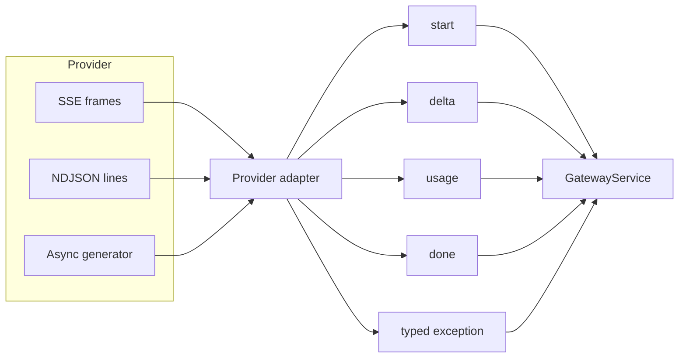

# Provider adapter contract

Provider adapters isolate unstable external APIs from stable gateway behavior. Routing code should
not know whether a response arrived as OpenAI Responses events, Anthropic Messages events, Ollama
NDJSON, or an in-process deterministic call.

This is a deliberately narrow anti-corruption layer. It normalizes text generation, token counts,
latency, model identity, streaming, health, and error semantics. It does not pretend that every
provider feature has an exact equivalent elsewhere.

## Internal protocol

Every adapter implements `ProviderAdapter`:

```python
class ProviderAdapter(ABC):
    name: str

    @abstractmethod
    async def complete(self, request: GatewayRequest, route: ModelRoute) -> ProviderResult: ...

    @abstractmethod
    async def stream(
        self, request: GatewayRequest, route: ModelRoute
    ) -> AsyncIterator[ProviderStreamEvent]: ...

    async def health(self) -> bool: ...
    async def aclose(self) -> None: ...
```

`ProviderResult` contains only fields the rest of Aegis can interpret consistently:

| Field | Source and semantics |
|---|---|
| `provider_request_id` | Opaque upstream correlation ID when available |
| `text` | Concatenated assistant text; no provider envelope |
| `input_tokens` | Provider-reported input usage, or zero when absent |
| `output_tokens` | Provider-reported output usage, or zero when absent |
| `finish_reason` | Provider reason retained as a string for diagnostics |
| `ttft_ms` | Complete-call elapsed time for non-streaming adapters |
| `latency_ms` | Complete-call elapsed time |
| `raw_model` | Model/deployment identifier returned by the provider, falling back to route config |

For non-streaming requests, TTFT cannot be observed independently from completion time, so the
adapter reports the same elapsed duration for both. Streaming TTFT is measured by `GatewayService`
at the first normalized content delta.

## Normalized streaming events



Adapters may emit more than one `start` event: one for successful HTTP stream admission and another
when the provider supplies a request ID. Consumers must not use event count as a state machine.

Chunk boundaries are transport boundaries, not token boundaries. A delta may contain a partial
token, multiple tokens, whitespace, or a complete cached response. Concatenate in order.

## Error normalization

`raise_for_provider_status` converts HTTP status into stable gateway categories:

| Upstream condition | Aegis error | Client status | Retryable |
|---|---|---:|---|
| 401 or 403 | `provider_auth_error` | 502 | No |
| 429 | `provider_rate_limited` | 503 | Yes |
| 408 or 504 | `provider_timeout` | 504 | Yes |
| Other 5xx | `provider_unavailable` | 502 | Yes |
| Other 4xx | `invalid_provider_request` | 422 | No |
| HTTP transport failure | `provider_transport_error` | 502 | Yes |
| Unexpected adapter exception | `provider_adapter_error` | 502 | No |
| Terminal stream event | `provider_stream_error` | 502 | Yes |

Authentication failures are surfaced as gateway failures rather than 401 because the caller did not
present the bad provider credential; the gateway deployment did. Error bodies are reduced to a
bounded message. Raw provider responses are not returned to clients.

The taxonomy is intentionally small. Provider-specific error codes can be captured in internal
traces later, but routing and client retry logic should depend on stable categories.

## OpenAI Responses adapter

The OpenAI adapter calls `POST /v1/responses` directly with `httpx`. The complete request is shaped
as follows:

```json
{
  "model": "route model identifier",
  "input": [
    {"role": "developer", "content": "..."},
    {"role": "user", "content": "..."}
  ],
  "max_output_tokens": 512,
  "stream": false,
  "store": false,
  "metadata": {
    "gateway_request_id": "request UUID",
    "tenant": "tenant namespace"
  }
}
```

Tool-role messages are excluded because Aegis does not yet expose a normalized tool-result content
contract. Silently converting an arbitrary string into a provider-specific tool result would be
worse than documenting that limitation.

When a response schema is present, the adapter adds:

```json
{
  "text": {
    "format": {
      "type": "json_schema",
      "name": "schema_name",
      "strict": true,
      "schema": {"type": "object"}
    }
  }
}
```

The response parser first checks the convenience `output_text` field. If absent, it walks message
items and joins `output_text` content blocks. Refusal or non-text blocks are not coerced into text.

For streaming, the adapter consumes SSE data frames and recognizes:

| OpenAI event | Normalized event |
|---|---|
| `response.created` | `start` with response ID |
| `response.output_text.delta` | `delta` |
| `response.completed` | `usage`, then `done` |
| `response.failed` or `error` | typed terminal stream error |

The implementation follows the current official
[Responses streaming guide](https://developers.openai.com/api/docs/guides/streaming-responses)
and [Structured Outputs guide](https://developers.openai.com/api/docs/guides/structured-outputs).
Provider APIs evolve; contract tests should be reviewed when these documents or the API changelog
change.

## Anthropic Messages adapter

Anthropic represents system instructions separately from conversational messages. The adapter joins
`system` and `developer` messages with a blank line into the top-level `system` field. Only `user`
and `assistant` messages enter the `messages` array.

```json
{
  "model": "route model identifier",
  "system": "system instructions\n\ndeveloper instructions",
  "messages": [{"role": "user", "content": "..."}],
  "max_tokens": 512,
  "stream": false,
  "metadata": {"user_id": "opaque identifier"}
}
```

`user_id` falls back to the request ID. Do not pass email addresses, names, or other direct
identifiers through this field; hash or map them before the gateway boundary.

Structured output uses the current `output_config.format` form:

```json
{
  "output_config": {
    "format": {
      "type": "json_schema",
      "schema": {"type": "object"}
    }
  }
}
```

The complete response joins text content blocks. Streaming recognizes `message_start`, text-valued
`content_block_delta`, `message_delta` usage, `message_stop`, and terminal `error` events. Input usage
is captured at message start and paired with output usage from the message delta.

The implementation is aligned with Anthropic's official
[Messages API reference](https://platform.claude.com/docs/en/api/messages/create),
[streaming guide](https://platform.claude.com/docs/en/build-with-claude/streaming), and
[structured-output guide](https://platform.claude.com/docs/en/build-with-claude/structured-outputs).
Sampling fields are model-dependent. A route catalogue and evaluation suite must verify that
`temperature` is accepted by the configured model rather than assuming one request shape works for
all current and future Anthropic models.

## Ollama adapter

Ollama is treated as a private/local provider, not as a special bypass around normal policy. Its
route still declares capabilities, context, privacy modes, expected latency, and region.

The adapter calls `POST /api/chat`:

```json
{
  "model": "qwen3:8b",
  "messages": [{"role": "user", "content": "..."}],
  "stream": true,
  "options": {
    "num_predict": 512,
    "temperature": 0.2
  },
  "format": {"type": "object"}
}
```

Developer messages are excluded because the Ollama chat contract does not provide a distinct
developer role with semantics equivalent to the hosted APIs. A deployment that requires those
instructions should explicitly map them to a model template and evaluate that behavior.

Ollama streaming uses newline-delimited JSON rather than SSE. Each non-empty line is decoded
independently. `message.content` becomes a delta; the final `done` object contributes token counts and
finish reason. The behavior follows Ollama's official [chat API](https://docs.ollama.com/api/chat)
and [streaming description](https://docs.ollama.com/api/streaming).

Health performs a one-second `GET /api/tags`. This checks endpoint reachability, not whether the
specific model is loaded, warm, correctly quantized, or able to fit in memory.

## Deterministic adapter

`MockAdapter` is a deterministic local provider used by CI, demos, and failure tests. For plain text
it returns a stable digest plus the last user message. For JSON Schema requests it recursively builds
a small valid example for objects, arrays, numeric types, booleans, nulls, constants, and enums.

Metadata can inject route-scoped rate-limit, timeout, authentication, or availability failures. This
lets tests verify fallback and circuit behavior without sleeping or depending on an external outage.
It is not enabled as a backdoor for real traffic; only routes whose provider is explicitly `mock`
can invoke it.

## SSE parser behavior

`iter_sse_json` accumulates all `data:` lines until a blank line, joins them with newlines, skips the
`[DONE]` sentinel, and decodes a JSON object. It does not assume one network chunk equals one SSE
event. That assumption commonly passes unit tests and fails under proxies that split frames at
arbitrary byte boundaries.

Unknown SSE fields and non-data lines are ignored. Malformed JSON raises through the adapter and is
normalized as an adapter failure. A stricter implementation may attach a bounded redacted frame
sample to an internal trace, but should not log full model output by default.

## Compatibility matrix

This table describes the adapter code in this repository, not every capability offered by each
provider.

| Aegis behavior | OpenAI | Anthropic | Ollama | Deterministic |
|---|---:|---:|---:|---:|
| Complete text | Yes | Yes | Yes | Yes |
| Normalized text streaming | Yes, SSE | Yes, SSE | Yes, NDJSON | Yes, async generator |
| JSON Schema request | `text.format` | `output_config.format` | `format` | Generated fixture |
| Provider token usage | Yes | Yes | Yes | Estimated |
| Request ID capture | Yes | Yes | No | Synthetic |
| Route health check | Key configured | Key configured | `/api/tags` | Always healthy |
| Normalized tool calls | No | No | No | No |
| Normalized image input | No | No | No | No |

Route capabilities for tools and vision are present to model policy shape, but the native API does
not yet carry provider-independent tool or image content. Do not enable those route capabilities for
production callers until the domain contract and adapter tests are extended together.

## Adding a provider

Adding an adapter is more than implementing an HTTP POST:

1. Implement `complete`, `stream`, `health`, and `aclose` without leaking provider objects.
2. Decide exactly which message roles and content types are supported. Reject or deliberately map
   unsupported forms.
3. Set a deadline on connection and response operations from the caller budget.
4. Normalize status codes and transport errors. Do not retry inside the adapter; fallback belongs to
   the service where the full candidate set is visible.
5. Parse streaming incrementally without relying on transport chunk alignment.
6. Capture authoritative token usage and the actual model identifier when available.
7. Add complete, streaming, malformed-frame, authentication, rate-limit, timeout, and terminal-event
   tests using `httpx.MockTransport` or an equivalent in-memory transport.
8. Register the adapter in `create_runtime`.
9. Add disabled route examples, then verify region, privacy, prices, context, capabilities, and
   latency before enabling them.
10. Run the same immutable evaluation dataset against the route and baseline.

## Provider conformance tests

The test suite does not contact real provider endpoints. It captures outbound JSON and headers,
returns representative success and failure payloads, streams SSE/NDJSON fixtures, and asserts the
normalized result. This keeps CI deterministic and prevents test runs from spending API credits.

Live contract tests still have value, but they belong in a separately gated workflow with a tiny
budget, dedicated credentials, explicit model allowlist, provider rate-limit handling, and no
unreviewed pull-request access to secrets.
