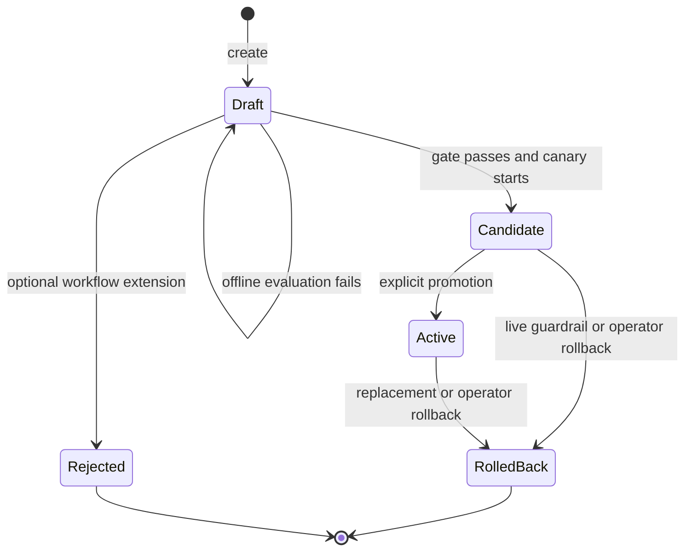
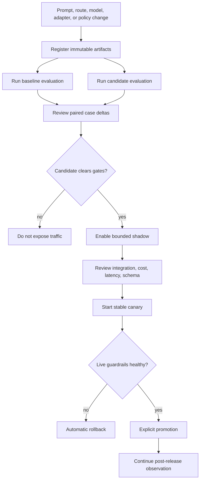
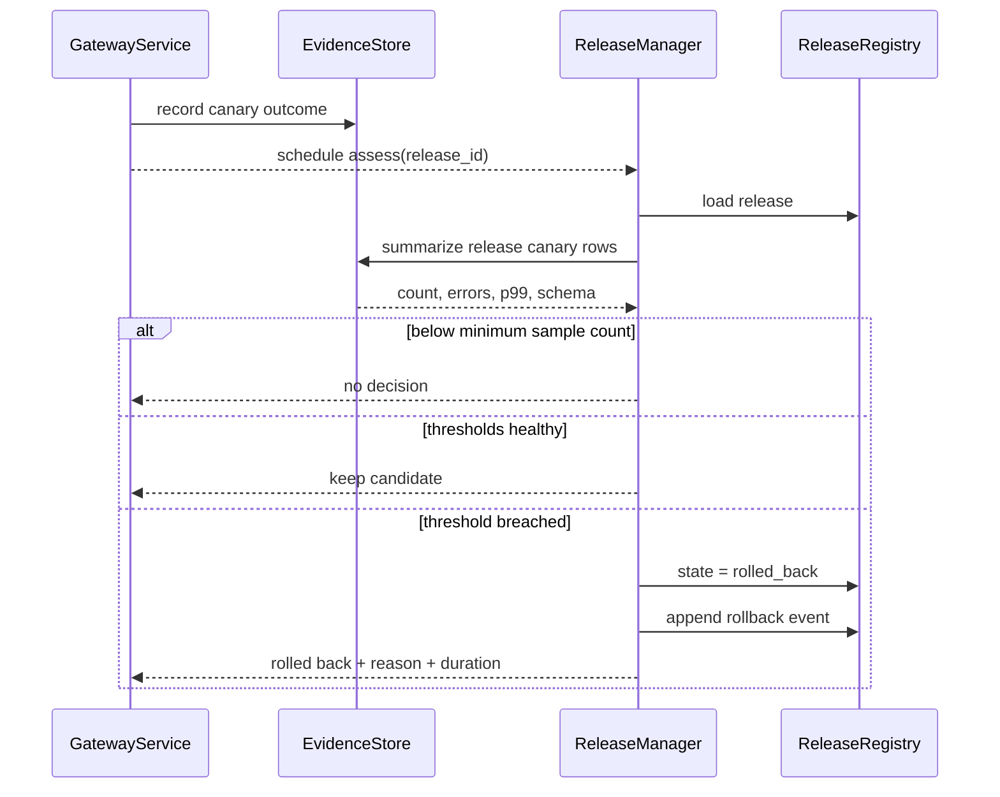

# Release engineering

A model route is a production dependency whose behavior can change without an application binary
change. Aegis treats route changes as releases: evaluate offline, observe shadow traffic, expose a
stable canary cohort, enforce live guardrails, then promote or roll back.

## Release object

A `Release` connects one baseline route to one candidate route and carries its own rollout and gate
parameters:

```json
{
  "id": "support-router-2026-09-04",
  "name": "default",
  "baseline_route_id": "mock-primary",
  "candidate_route_id": "mock-canary",
  "canary_percent": 5,
  "shadow_percent": 20,
  "state": "draft",
  "max_error_rate": 0.02,
  "max_p99_latency_ms": 2500,
  "min_schema_compliance": 0.995,
  "min_quality_score": 0.90,
  "min_canary_samples": 200
}
```

The release references route IDs rather than provider/model strings. This keeps provider credentials,
region declarations, prices, and capabilities in one reviewed catalogue.

## Lifecycle



The reference implementation models `rejected` but leaves a gate-failing release in `draft`. This
preserves the object for another evaluation after a new dataset or threshold review. A larger control
plane may make rejection an explicit terminal decision and require a new release ID for another
attempt.

## Recommended workflow



Offline gates catch known cases. Shadow traffic catches integration and distribution shift without
affecting user output. Canary traffic measures user-visible behavior. None substitutes for the other.

## Deterministic cohort assignment

For release `R`, request ID `X`, and lane label `L`, Aegis computes:

\[
b(R,X,L)=integer(SHA256(R || ":" || L || ":" || X)_{0:8}) \bmod 100
\]

A request enters the canary when:

\[
b(R,X,"canary") < canary\_percent
\]

For a non-canary request with shadow enabled, it enters the shadow lane when:

\[
b(R,X,"shadow") < shadow\_percent
\]

The assignment is stable for the same release and request ID. It does not require mutable cohort
state and avoids random reassignment on retries.

### Unit of assignment

The current key is request ID, not user or tenant. Two requests from the same user can land in
different cohorts. That is appropriate for stateless completion evaluation but not for a persistent
conversation whose model behavior should remain stable.

For conversational products, derive a trusted experiment unit—conversation, account, or user—and
hash that value instead. Do not accept an arbitrary caller-controlled cohort key if canary exposure
has policy or cost consequences.

### Percentage granularity

Modulo 100 gives one-percentage-point resolution. Small traffic releases may receive a noisy realized
fraction. A larger bucket space (for example 10,000 basis points) improves granularity but does not
solve insufficient sample size.

## Preference is not authorization

Canary assignment gives the router a preferred route. The candidate still has to satisfy all hard
constraints. If it lacks local-only privacy, streaming, required context, or the caller's region, it
is excluded and the router selects another eligible route.

This behavior means realized canary exposure can be lower than configured. Track:

- assigned canary requests;
- candidate-eligible assigned requests;
- candidate attempts;
- successful candidate responses.

The reference evidence records the assignment and final route, allowing those distinctions to be
derived, though the Prometheus surface does not expose all four counters directly.

## Shadow traffic

Shadow execution copies a successful user request and changes execution fields:

| Field | Shadow value | Reason |
|---|---|---|
| request ID | parent ID plus `-shadow` | Correlate without row collision |
| stream | `false` | No downstream consumer for deltas |
| cache mode | `bypass` | Exercise the candidate |
| shadow enabled | `false` | Prevent recursive shadowing |
| forced route | candidate route | Measure exactly the release target |
| release ID | inherited | Keep evidence attached to the experiment |

Shadow failure never changes the already successful user response. It is stored with `shadow=true`
and should be excluded from user-availability SLOs while remaining visible in release analysis.

### Cost and capacity

Shadow traffic is real inference traffic. For baseline request rate `\lambda`, canary fraction `c`,
and shadow fraction `s` applied to non-canary requests:

\[
extra\_shadow\_rate=\lambda(1-c)s
\]

Include this in provider quotas and spend limits. Start with a small percentage and a bounded worker
pool. The reference uses in-process tasks and is suitable for demonstration, not unbounded production
fan-out.

### What shadow cannot measure

Shadow can measure provider success, schema compliance, output, latency, and cost. It cannot directly
measure user satisfaction, downstream actions, or interactive conversation effects because its
output is discarded. It may also see warmer or colder caches than user traffic depending on provider
infrastructure.

## Offline gate before canary

The start-canary endpoint obtains the release, runs its candidate route against the named immutable
dataset, enforces the release thresholds, and only then changes state to `candidate`.

If evaluation fails, state does not change. The returned `evaluation_gate_failed` message reports all
quality, schema, p99, and failure-rate violations found in the aggregate run.

Production gates should additionally require:

- a baseline run on the same dataset version;
- no regression on critical tags;
- approved prompt/model/policy artifact hashes;
- provider access and region validation;
- signed container/config versions;
- spend and quota headroom for shadow plus canary;
- an on-call owner and rollback runbook.

## Live assessment

For a candidate release, `ReleaseManager.assess` loads canary evidence. It waits until
`min_canary_samples`, then checks:

\[
1-success\_rate \le max\_error\_rate
\]

\[
p99\_latency \le max\_p99\_latency
\]

\[
schema\_compliance \ge min\_schema\_compliance
\]

Schema is checked only when schema-constrained samples exist. Every breached condition is included in
the rollback reason.

If any threshold fails, the manager measures the time to set release state to `rolled_back`, records
a rollback event, and returns a `RollbackDecision`.



### Assessment limitations

The reference summary covers all evidence ever written for that release ID and uses threshold rules
without confidence intervals. It does not compare against concurrent baseline health. A shared
provider outage can make the candidate look bad even when baseline is equally affected.

A mature guard should use:

- a bounded time window;
- paired or concurrent baseline comparison;
- minimum sample count per critical slice;
- sequential testing or confidence bounds;
- hysteresis to prevent flapping;
- explicit treatment of cache hits and retries;
- a hard ceiling on spend and safety incidents;
- exactly-once or idempotent evidence ingestion.

## Promotion

Promotion changes the candidate release to `active`. The registry rolls another active release with
the same name to `rolled_back` in the same SQLite transaction. New assignments prefer the active
candidate route for 100% of requests where it remains eligible.

Promotion is explicit even when all live thresholds pass. Automated promotion optimizes deployment
speed but can turn an incomplete metric set into a release decision. If enabled later, require a
minimum observation duration and approved metric/data freshness.

## Rollback

Manual and automatic rollback set state to `rolled_back`. Future `get_live` calls no longer return
that release, so routing falls back to another live release or normal utility policy.

Rollback time measured by the reference is database state-transition time. End-to-end mitigation
also includes:

- evidence delay;
- assessment scheduling delay;
- cache and release-state propagation;
- request assignment refresh;
- in-flight request completion;
- operator detection when rollback is manual.

Report those separately. A sub-millisecond SQLite update is not proof that users recovered in a
millisecond.

## Cache isolation during releases

Model-release experiments and semantic caching interact. If a canary request can reuse an answer
created by the baseline, the sample says nothing about the candidate. If baseline and candidate
outputs share one key, promotion can also serve stale baseline output.

The safe choices are:

1. bypass cache for canary and shadow calls;
2. include release and route identity in the cache namespace;
3. invalidate affected entries at release transitions.

The reference implements the first two controls. Release assignment occurs before lookup. Canary,
shadow, and evaluation calls bypass cache reads and writes; forced-route calls use their own route
namespace; baseline and active traffic use a namespace containing both release ID and preferred
route. A promotion therefore cannot read an entry written by the pre-release default lane or another
release.

Release transitions do not scan and delete old entries. Those entries become unreachable through
normal assignment and age out through TTL/LRU eviction. A distributed cache should retain the same
namespace rule and may additionally invalidate by release prefix to reclaim storage promptly.

## Operational checks by phase

| Phase | Required evidence | Stop condition |
|---|---|---|
| Draft | Artifact hashes, baseline/candidate offline runs | Missing provenance or failed critical case |
| Shadow | Provider success, schema, latency, cost, quota headroom | Integration error, cost spike, incompatible contract |
| Canary | User-visible success, p99, schema, safety, slice health | Any hard guardrail or statistically credible regression |
| Active | Sustained SLO, support signals, spend, drift | Regression, provider change, incident |
| Rolled back | Assignment verification and recovery metrics | Candidate traffic persists or evidence is incomplete |

## API workflow

Create a draft release:

```bash
curl -sS -X POST http://127.0.0.1:8000/v1/control/releases \
  -H "Authorization: Bearer $AEGIS_ADMIN_TOKEN" \
  -H 'Content-Type: application/json' \
  -d '{
    "id": "candidate-2026-09-04",
    "name": "default",
    "baseline_route_id": "mock-primary",
    "candidate_route_id": "mock-canary",
    "canary_percent": 5,
    "shadow_percent": 20,
    "min_canary_samples": 100,
    "max_error_rate": 0.02,
    "max_p99_latency_ms": 2500,
    "min_schema_compliance": 0.995,
    "min_quality_score": 0.90
  }'
```

Start the canary only after running the candidate evaluation:

```bash
curl -sS -X POST \
  http://127.0.0.1:8000/v1/control/releases/candidate-2026-09-04/start-canary \
  -H "Authorization: Bearer $AEGIS_ADMIN_TOKEN" \
  -H 'Content-Type: application/json' \
  -d '{"dataset_name":"gateway-smoke","dataset_version":"1.0.0"}'
```

Assess or roll back:

```bash
curl -sS -X POST \
  http://127.0.0.1:8000/v1/control/releases/candidate-2026-09-04/assess \
  -H "Authorization: Bearer $AEGIS_ADMIN_TOKEN"

curl -sS -X POST \
  http://127.0.0.1:8000/v1/control/releases/candidate-2026-09-04/rollback \
  -H "Authorization: Bearer $AEGIS_ADMIN_TOKEN" \
  -H 'Content-Type: application/json' \
  -d '{"reason":"incident-2026-09-04-01"}'
```
