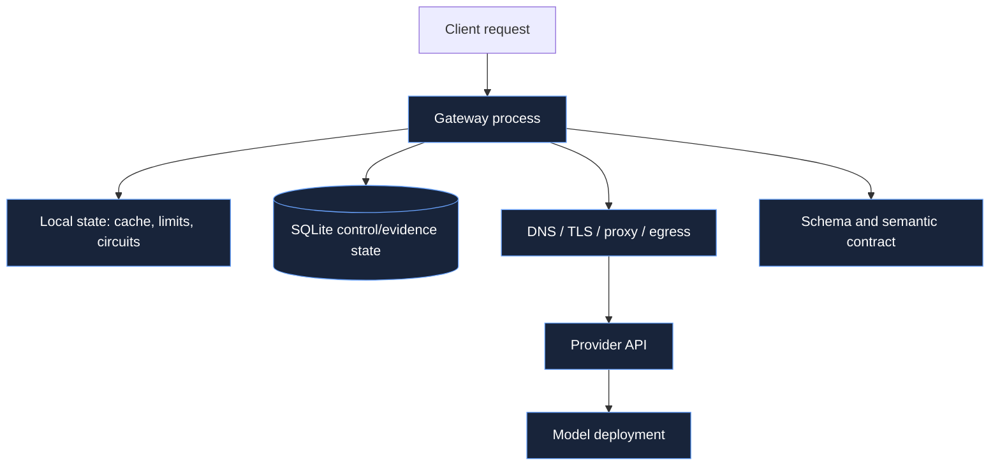
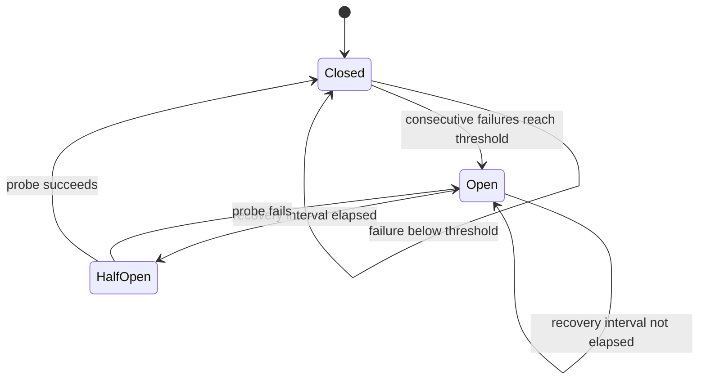
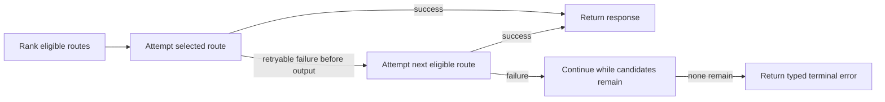

# Reliability model

Reliability in a model gateway is not equivalent to retrying another provider. Retries can increase
cost, exceed the caller's deadline, duplicate side effects, and combine outputs with unclear
provenance. Aegis uses admission control, route-local circuit breakers, constrained fallback, typed
errors, and release rollback as distinct layers.

## Failure domains

Each box fails differently:

- **Gateway process:** crash, event-loop starvation, file descriptor exhaustion, memory pressure.
- **Local state:** per-replica quota drift, cold cache, circuit disagreement after restart.
- **Registry:** lock contention, disk full, corrupt database, failed evidence write.
- **Network:** timeout, reset, certificate failure, proxy buffering, partial stream.
- **Provider:** authentication failure, rate limit, 4xx contract change, regional outage, 5xx.
- **Model deployment:** latency shift, context rejection, malformed output, semantic regression.
- **Schema/semantic layer:** valid HTTP but invalid JSON, valid JSON but wrong task result.

Treating all of them as "provider unavailable" destroys the signal needed for safe fallback and
rollback.

## Per-tenant token bucket

The reference limiter stores one bucket per tenant. Let:

- `r` be refill tokens per second;
- `B` be maximum burst capacity;
- `b(t_0)` be tokens at the previous update;
- `\Delta t` be elapsed monotonic time.

Before consuming `k` tokens:

\[
b(t)=\min(B,b(t_0)+r\Delta t)
\]

The request is admitted when `b(t) \ge k`, after which:

\[
b'(t)=b(t)-k
\]

Otherwise the limiter fails without sleeping and reports an approximate retry delay:

\[
retry\_after=\frac{k-b(t)}{r}
\]

An `asyncio.Lock` makes refill and consume atomic within one process. Buckets use monotonic time, so
wall-clock changes cannot create or remove quota.

### What this limiter does not do

It does not limit concurrent in-flight requests, tokens generated, dollars spent, or global traffic
across replicas. A tenant sending five requests per second can still request very long outputs. Add
separate controls for:

- in-flight concurrency;
- daily/monthly spend;
- input and output token volume;
- evaluation and shadow worker capacity;
- provider-specific organization limits.

For multiple replicas, move consume/refill into one atomic Redis script or a dedicated rate-limit
service. Dividing the global rate by replica count is inaccurate under uneven load and autoscaling.

## Route circuit breaker

Circuits are keyed by route ID, not provider name. Two deployments of the same provider may fail
independently by region, model, account, or network path.

Only one half-open probe may run. While it is in flight, another admission receives
`circuit_open`. This avoids a recovery stampede.

The default threshold is three consecutive provider failures and the default recovery interval is 30
seconds. A success resets the count. Schema violations do not currently open a transport circuit;
they are visible through schema compliance and release gates instead.

### Circuit trade-offs

A low threshold reduces wasted latency during a hard outage but reacts strongly to isolated faults.
A long recovery interval protects an overloaded provider but delays recovery. Tune per route using
observed error burst length and provider quota behavior rather than one global folklore value.

In a multi-replica service, keeping circuits local is often correct: one pod may have a broken egress
path while another is healthy. Aggregate route health for operators, but do not automatically make
one pod's observation a global outage without quorum or independent evidence.

## Fallback

Fallback is attempted only over candidates that already passed the original hard constraints.

Fallback count is stored on the final response and evidence row. `failover_success_rate` measures
whether degraded requests eventually succeed, not merely whether fallback was attempted.

### Retry budget

The reference code makes at most one attempt per eligible route and does not perform same-route
retries. This avoids exponential cost and keeps the failure path bounded by catalogue size. A
same-route retry can be useful for a connection reset before request acceptance, but only if the
provider operation is known to be idempotent and the end-to-end deadline has enough remaining time.

Do not multiply retries across layers. If an ingress retries twice, Aegis tries three routes, and a
provider SDK retries twice, one client request can produce eighteen upstream attempts.

## Deadlines and timeouts

Three latency concepts should remain separate:

1. **Route admission prior:** `expected_p95_latency_ms` must fit the caller's budget.
2. **Provider transport timeout:** adapters derive an HTTP timeout from `max_latency_ms`.
3. **Gateway deadline:** the caller's budget measured from service admission across prompt lookup,
   rate limiting, cache/release/routing work, and all provider attempts.

The reference records one monotonic start time, subtracts elapsed time before every candidate, passes
the remaining milliseconds to the adapter, and wraps the complete call or stream iterator in the
same remaining-time bound. Once the budget is exhausted, it does not start another fallback. This
prevents route count from multiplying the caller's provider-wait budget.

JSON Schema validation and evidence persistence run after a successful provider operation and are
not preempted by the local timeout scope. They can therefore make observed response latency slightly
greater than `max_latency_ms`. Reserve explicit local overhead in the admission budget, and enforce a
hard connection deadline at the ingress if the external protocol requires one.

For start time `t_0` and budget `L_max`:

\[
deadline=t_0+L_{max}
\]

Before attempt `i` at time `t_i`:

\[
remaining_i=deadline-t_i
\]

Attempt `i` is reasonable only when `remaining_i>0`; a stricter policy requires
`expected\_p95(route_i) \le remaining_i`. Transport timeout should be no larger than remaining time.

## Streaming reliability

Streaming introduces a commit point at the first content delta:

- before the commit point, fallback may choose another eligible route;
- after the commit point, failure ends the stream with `stream_interrupted`;
- assembled structured output is validated at the end;
- usage may be unavailable if the provider fails before its terminal event.

Proxies must disable response buffering for SSE. The API sets `X-Accel-Buffering: no` and
`Cache-Control: no-cache`, but an ingress can still buffer or impose its own idle timeout. Test the
deployed path, not just direct localhost behavior.

Clients should persist enough state to decide whether to display partial text, retry from scratch, or
ask a user. They should never append a retry response to the partial stream as if it were continuous.

## Evidence as a reliability dependency

Online success is recorded before cache insertion and post-response release assessment. If evidence
cannot be written, the request currently fails rather than returning an unobserved canary result.
This is a deliberate safety bias: release automation built on incomplete samples can keep a broken
candidate active.

At larger scale, synchronous writes to a central database can become both a latency cost and a
single point of failure. Use a transactional outbox or durable local log so the response path can
commit evidence without waiting for an analytics warehouse. Define how much evidence loss is
tolerable; "best effort" is not a release policy.

## Shadow and canary load

Shadow percentage adds extra inference traffic. If baseline traffic rate is `\lambda`, canary
fraction is `c`, and shadow fraction applies only to non-canary requests at rate `s`, expected
provider calls per second are approximately:

\[
\lambda_{calls}=\lambda\left(1+(1-c)s\right)
\]

For a 5% canary and 20% shadow fraction:

\[
\lambda_{calls}=\lambda(1+0.95\cdot0.20)=1.19\lambda
\]

That is 19% additional inference traffic before retries. Capacity and spend plans must include it.

The reference launches shadow calls as tracked in-process tasks. Process termination can lose them.
Use a bounded queue and worker pool for durable experiments; unbounded task creation under load is a
memory and upstream-capacity risk.

## Load shedding and backpressure

The token bucket sheds by tenant request rate, but FastAPI can still accept more concurrent work than
providers or the evidence database can sustain. A production server should add:

- global and per-route concurrency semaphores;
- bounded queues with explicit 429/503 behavior;
- connection-pool limits aligned with provider quotas;
- request-body and header limits at ingress;
- stream duration and idle limits;
- lower-priority pools for shadow and offline evaluation;
- adaptive shedding when evidence storage or event-loop lag degrades.

Queueing every request is not graceful degradation. Once expected queue delay consumes the caller's
deadline, fail quickly enough for the caller to choose another path.

## Failure policy matrix

| Failure | Retry another route? | Open circuit? | User response | Release evidence |
|---|---:|---:|---|---:|
| Provider 5xx before output | Yes | Yes | Success or terminal typed error | Yes |
| Provider rate limit before output | Yes | Yes | Success or 503 | Yes |
| Provider auth failure | Current service may try another route | Yes | Success or 502 | Yes |
| Invalid provider request | No | Yes | 422 | Yes |
| Schema violation before streamed output | Yes | No | Success or 502 | Yes |
| Provider failure after streamed output | No | Yes | SSE error / exception | Yes |
| Final schema failure after streamed output | No | No | SSE error / exception | Yes |
| Cache miss or eviction | Not a failure | No | Normal provider path | Hit/miss aggregate only |
| Shadow failure | No user retry | Route-dependent | No user impact | Separate shadow row |
| Registry/evidence write failure | No hidden success | No | 500 | May require outbox recovery |

Authentication and invalid-request errors deserve route-specific policy in a larger system. An auth
failure caused by one provider account can justify fallback; retrying another deployment under the
same broken account cannot.

## Availability calculation

If two eligible provider routes fail independently with availabilities `A_1` and `A_2`, idealized
fallback availability is:

\[
A_{combined}=1-(1-A_1)(1-A_2)
\]

For two 99% routes this suggests 99.99%. The independence assumption is usually false: routes may
share DNS, cloud region, identity, egress, model backend, or quota. Measure common-mode failure and
draw the dependency graph before using this formula in an SLO.

Gateway, registry, and client deadline availability also multiply into the end-to-end result.

## Graceful shutdown

On shutdown, the runtime awaits tracked background tasks and closes owned HTTP clients. Deployment
infrastructure still needs to:

1. mark the replica unready;
2. stop new connections;
3. allow non-streaming requests and bounded streams to drain;
4. stop shadow/evaluation intake;
5. flush durable evidence;
6. terminate before the platform's hard grace deadline.

The included Kubernetes manifest has probes but no explicit pre-stop drain hook. Add one when stream
duration is material.

## Reliability tests that matter

Unit tests cover refill timing, burst exhaustion, half-open single probes, pre-output fallback,
post-output interruption, schema fallback, provider error normalization, and shadow evidence. Before
a real launch, add environment tests for:

- provider latency beyond the caller deadline;
- DNS and TLS failure;
- proxy SSE buffering and idle timeout;
- SQLite disk full and lock contention;
- process death with shadow tasks in flight;
- cache/limiter disagreement across replicas;
- provider quota exhaustion during a canary;
- rolling deployment while an active release is being promoted or rolled back.
