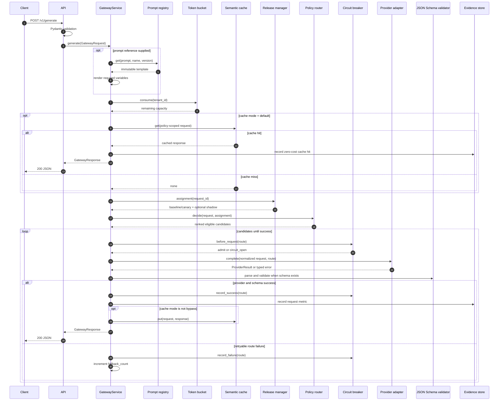
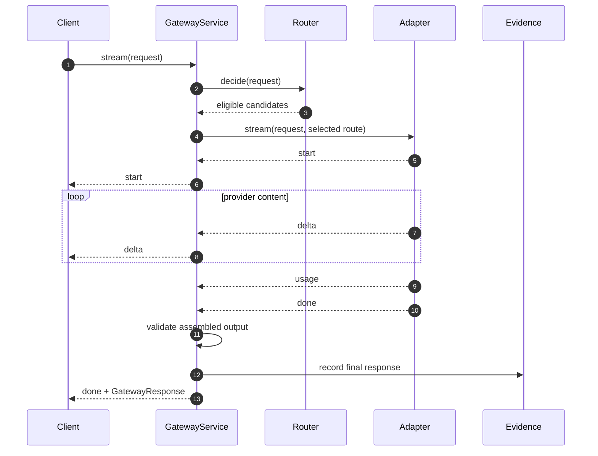
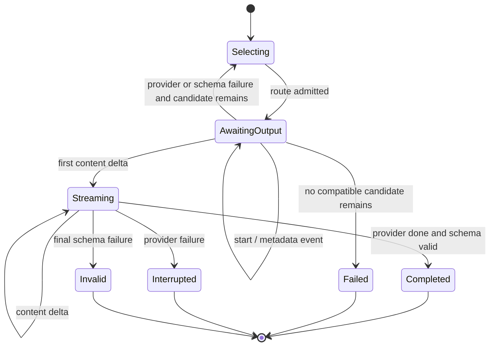
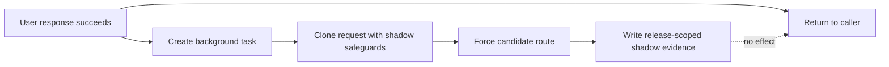

# Request lifecycle

This document follows a request through `GatewayService`, including the branches that are easy to
miss in a high-level architecture diagram. The complete and streaming paths share policy and
provider contracts, but they cannot share identical fallback behavior once bytes have reached a
caller.

## Input boundary

FastAPI parses a native request into `GatewayRequest`. Pydantic v2 rejects unknown fields and checks
identifier syntax, message counts and lengths, cost and latency bounds, output-token limits, and
temperature. A model validator adds capabilities implied by the request:

- `text` is always required;
- `streaming` is required when `stream=true`;
- `structured_output` is required when `response_schema` is present.

This inference matters because a caller should not need to duplicate internal capability labels,
and because omitting one must not weaken route filtering.

The compatibility endpoint translates its narrower chat-completions request into the same native
model. From that point onward there is one execution path.

## Non-streaming sequence

The diagram shows a logical early return for a cache hit. The implementation still rewrites the
request ID, timestamps, timing values, and usage before returning. A cache hit reports zero input
tokens, zero output tokens, and zero provider cost because no provider request occurred.

## Prompt resolution

`ArtifactRef` can omit a version. In that case the registry resolves the latest stored version for
that name. For a reproducible production release, pin the version. A mutable "latest" reference is
convenient during development but makes it harder to reproduce an incident.

Templates use a deliberately small `{{ variable }}` syntax. Before substitution, the service finds
all referenced variables and fails if any are missing. It does not execute Python, Jinja filters, or
arbitrary template expressions. The rendered text becomes a leading `developer` message, preserving
the caller's original messages.

Prompt resolution happens before the cache key is derived. Both the artifact reference and the
rendered message content therefore influence reuse.

## Admission and cache order

The tenant token bucket is consumed before cache lookup. This is a policy choice:

- cache hits still consume gateway CPU, memory bandwidth, and network capacity;
- allowing unlimited cached reads creates a denial-of-service bypass;
- a consistent admission point is easier to explain to clients.

A deployment that wants separate cached and uncached quotas can implement two explicit buckets. It
should not silently move the limiter after the cache and leave cache-miss traffic as the only metered
class.

`evaluation=True` and `shadow=True` skip normal tenant admission because those calls are internal.
They need independent worker concurrency and budget controls in a multi-process deployment; the
reference implementation keeps them lightweight and deterministic.

## Release assignment before routing

The release manager returns a preference, not an authorization. For a candidate release it chooses
baseline or candidate using a stable hash of release ID, lane, and request ID. It may also attach a
shadow route. The router then subjects that preferred route to the same hard filters as every other
route.

Assignment also happens before cache lookup. The release ID and preferred route form part of the
cache namespace. Canary requests bypass reads and writes entirely, as do evaluation and shadow
calls. Forced-route requests use a route-specific namespace. This ordering prevents a warm baseline
entry from making a candidate appear successful without invoking it.

If a candidate model cannot satisfy a request's privacy or capability contract, the preference is
ignored because the candidate never enters the feasible set. This prevents release configuration
from acting as a policy bypass.

## Candidate loop

The router returns candidates in utility order and marks the selected candidate. The service moves
the selected candidate to the front—important when a canary preference intentionally chooses a route
that is not utility-optimal—then retains the remaining eligible routes as fallback.

For each candidate:

1. Compute the remaining request budget; stop if it is exhausted.
2. Ask the route's circuit breaker for admission.
3. Invoke the provider adapter under that remaining-time bound.
4. Parse and validate structured output, if requested.
5. Close/reset the circuit on provider success.
6. Construct provider-independent usage and cost.
7. Write evidence.
8. Populate cache when allowed.
9. Schedule shadow traffic and canary assessment.

Provider failures increment the circuit. Schema failures do not currently increment it because a
route may be transport-healthy while producing semantically invalid output. Both may trigger
fallback. A provider error classified as `invalid_provider_request` stops the loop because replaying
the same incompatible request across nominally compatible routes is unlikely to help and can create
cost without recovery.

## Streaming sequence

Provider stream events are normalized into five internal event types:

| Internal event | Meaning | Forwarded to native client? |
|---|---|---|
| `start` | Stream accepted; optional provider request ID | Yes |
| `delta` | Incremental text | Yes |
| `usage` | Provider token accounting | No, folded into final response |
| `done` | Provider completed | No direct pass-through; gateway emits its own final event |
| `error` | Reserved normalized error event | Converted to typed failure |

The service assembles all deltas because JSON Schema validation applies to the complete value. That
means a structured stream is optimistic: clients see fragments before final schema validation. A
caller that must never act on unvalidated data should request a non-streaming response or buffer the
stream until the final `done` event.

### Time to first token

For a normal stream:

\[
TTFT = t_{first\_delta} - t_{gateway\_start}
\]

If the provider completes without a content delta, completion time is used as TTFT. The metric
therefore remains defined but should be interpreted as "time to first usable output" for an empty
response.

## Streaming fallback state machine

The first content delta is the commit point. Before it, changing providers is invisible except for
latency and evidence. After it, switching would splice two independently generated sequences. Aegis
raises `StreamInterruptedError`, records the failing route, and leaves retry policy to the caller.

An API streaming handler catches typed Aegis errors and encodes an SSE error event. Direct Python
callers receive the exception.

## Cache-hit streaming

A cached streaming response is sent as exactly three native events: `start`, one `delta` containing
the cached text, and `done` containing the rewritten `GatewayResponse`. It does not mimic the token
chunking of the original provider response. Clients must treat deltas as arbitrary fragments and
must not rely on a fixed size or token boundary.

## Shadow execution

Shadow work begins only after the user path succeeds. It receives:

- a derived request ID ending in `-shadow`;
- `stream=false`;
- cache bypass;
- `shadow_enabled=false` to prevent recursion;
- the release ID of the parent assignment;
- a forced candidate route.

The background task is tracked so runtime shutdown can await it. In a real deployment, an in-process
task is not durable: a crash after the user response can lose the shadow sample. A queue-backed
worker should replace this path when shadow evidence is release-critical.

## Error paths and evidence

Terminal online errors write a failed `RequestMetric` with zero token/cost fields, the elapsed
latency, fallback count, release/canary/shadow labels, and an error code. The route recorded is the
last attempted candidate.

Errors that occur before a routing decision—request validation, missing prompt artifacts, missing
template variables, rate limiting, or an empty feasible set—are returned by the API but are not all
currently written to `request_metrics`. That is a known observability boundary. A production ingress
should count rejected requests separately so policy rejections and service failures are not mixed.

## Shutdown behavior

`GatewayService.aclose` waits for tracked shadow and assessment tasks with
`return_exceptions=True`, then closes owned provider clients through the registry. API lifespan calls
runtime initialization on startup and service close on shutdown.

Graceful process termination still needs an external drain period. Kubernetes should stop routing
new traffic, allow active streams to finish up to a bounded deadline, and only then terminate the
pod. The included manifest provides probes but does not implement a custom drain endpoint.
