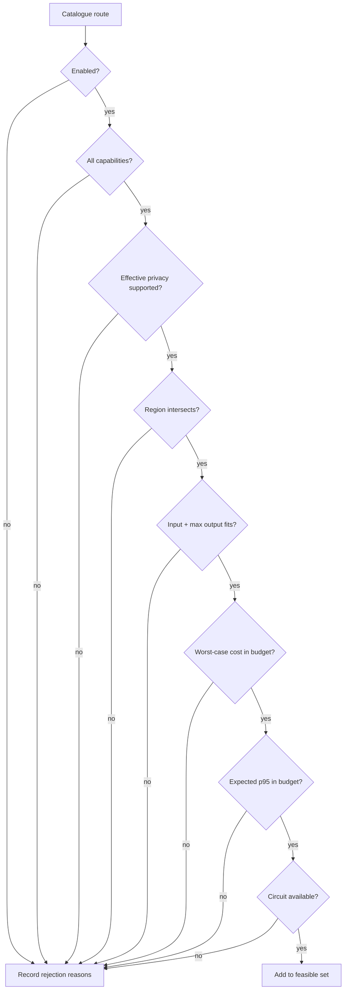

# Routing policy

Routing is implemented as two separate operations:

1. construct the feasible set by applying hard constraints;
2. rank the feasible set with an explicit utility function.

Keeping those operations separate is the most important property of the router. A single weighted
score that mixes privacy, residency, cost, and quality can always trade one away for another. Aegis
does not permit that trade for policy constraints.

## Inputs to a routing decision

The router sees a normalized `GatewayRequest`, the loaded `ModelRoute` catalogue, circuit state, and
optional release hints.

### Request-side constraints

| Field | Meaning |
|---|---|
| `required_capabilities` | Features that must exist on the route; text, streaming, structured output, tools, or vision |
| `data_classification` | Public, internal, confidential, or restricted data sensitivity |
| `privacy_mode` | Standard, zero-retention, or local-only processing |
| `allowed_regions` | Explicit set of acceptable route regions; empty means no caller region filter |
| `max_cost_usd` | Worst-case predicted request cost ceiling |
| `max_latency_ms` | Route expected-p95 ceiling and normalization denominator |
| `max_output_tokens` | Generation limit used for context and worst-case cost checks |
| `messages` | Input whose size is estimated before a provider is chosen |

### Route-side declarations

| Field | Meaning |
|---|---|
| `provider`, `model` | Adapter key and provider model/deployment identifier |
| `capabilities` | Features the deployment is configured and tested to support |
| `regions` | Processing/residency labels asserted by the deployment owner |
| `context_window` | Maximum combined input and output token budget |
| `input_cost_per_million` | Catalogue price per million input tokens |
| `output_cost_per_million` | Catalogue price per million output tokens |
| `expected_p95_latency_ms` | Measured or provisioned route latency prior |
| `quality_score` | Normalized task-quality prior in `[0, 1]` |
| `privacy_modes` | Processing guarantees the route can meet |
| `enabled` | Administrative kill switch |

These values are assertions, not discoveries made during each request. A mature platform should
publish the catalogue through a reviewed configuration pipeline and reject stale measurements.

## Capability inference

The request model automatically adds capabilities implied by public fields:

\[
K_{required} = \{text\}
\cup \begin{cases}\{streaming\}, & stream=true\\\emptyset, & otherwise\end{cases}
\cup \begin{cases}\{structured\_output\}, & schema\neq\varnothing\\\emptyset, & otherwise\end{cases}
\]

Eligibility requires set containment:

\[
K_{required} \subseteq K_r
\]

This test is exact. A provider that can often be prompted to emit JSON but lacks a supported
structured-output path should not advertise `structured_output` until its adapter and evaluation set
demonstrate that contract.

## Input token estimate

Before selecting a provider, Aegis does not yet know which tokenizer will apply. The reference
estimator uses a conservative character heuristic:

\[
\hat{T}(s) = \max\left(1, \left\lceil \frac{|s|}{4} \right\rceil\right)
\]

and adds four accounting tokens per message:

\[
\hat{T}_{in} = \sum_{m \in messages}\left(\hat{T}(m.content) + 4\right)
\]

This estimate is useful for architecture tests, not a billing-grade tokenizer. It can undercount
some scripts, code, serialized tool payloads, and provider-specific framing. Production catalogues
should associate each route with an exact tokenizer or a calibrated upper confidence bound. An
underestimate weakens both context and cost admission.

## Predicted worst-case cost

For route `r`, input estimate `\hat{T}_{in}`, and caller output ceiling `T_{out,max}`:

\[
\hat{C}(r) =
\frac{
\hat{T}_{in}P_{in}(r) + T_{out,max}P_{out}(r)
}{10^6}
\]

The router compares worst-case output cost, not expected output cost, with the caller's hard budget:

\[
\hat{C}(r) \le C_{max}
\]

After completion, evidence uses provider-reported input and output counts with the same catalogue
prices:

\[
C_{actual}(r) =
\frac{T_{in}P_{in}(r) + T_{out}P_{out}(r)}{10^6}
\]

`C_actual` remains an estimate because provider token reporting and catalogue prices can lag billing
rules. Reconcile it with provider invoices before using it for chargeback.

## Privacy derivation

The effective privacy requirement may be stronger than the request's explicit mode:

| Data classification | Requested mode | Effective minimum |
|---|---|---|
| Public or internal | Any | Requested mode |
| Confidential | Standard | Zero-retention |
| Confidential | Zero-retention or local-only | Requested mode |
| Restricted | Any | Local-only |

In logical form, route `r` is eligible only when:

\[
privacy_{effective}(request) \in privacy\_modes(r)
\]

This is exact membership rather than an enum ordering. It avoids assuming, for example, that a route
labeled local-only automatically satisfies a separately audited zero-retention program. A catalogue
owner can declare both when both guarantees have been verified.

## Region semantics

If the caller supplies no allowed region, Aegis does not add a region constraint. Otherwise:

\[
allowed\_regions(request) \cap regions(r) \neq \emptyset
\]

`global` is an ordinary label, not a wildcard. Treating it as every jurisdiction would turn an
imprecise catalogue entry into an authorization. Prefer concrete processing labels such as
`eu-west`, `us-east`, or organization-specific trust zones.

## Complete eligibility predicate

A route belongs to the feasible set `F(x)` for request `x` when all of the following hold:

\[
\begin{aligned}
eligible(r,x) ={}& enabled(r) \\
&\land\ r \notin excluded \\
&\land\ (forced=\varnothing \lor id(r)=forced) \\
&\land\ K_x \subseteq K_r \\
&\land\ privacy_x \in privacy\_modes(r) \\
&\land\ (regions_x=\varnothing \lor regions_x\cap regions_r\neq\varnothing) \\
&\land\ \hat{T}_{in}+T_{out,max}\le context\_window(r) \\
&\land\ \hat{C}(r)\le C_{max} \\
&\land\ p95_r\le L_{max} \\
&\land\ circuit(r)\neq open
\end{aligned}
\]

The router preserves every rejection reason rather than stopping at the first. When no route is
eligible, the resulting error is useful for debugging a catalogue: one route may fail privacy and
another may fail context.



## Utility ranking

Eligible routes are ranked with the following default score:

\[
U(r,x) =
w_qQ(r)
- w_l\min\left(1,\frac{L_{p95}(r)}{L_{max}(x)}\right)
- w_c\min\left(1,\frac{\hat{C}(r,x)}{C_{max}(x)}\right)
\]

with:

\[
w_q=0.55,\quad w_l=0.25,\quad w_c=0.20,\quad
w_q+w_l+w_c=1
\]

`UtilityWeights` rejects values that do not sum to one. Quality contributes positively; latency and
cost consume utility as a fraction of the request's own limits. The score answers "which eligible
route best fits this request?" rather than imposing one global latency/cost trade-off.

The ratios are capped at one even though hard filters should already reject values above the limit.
The cap keeps the function bounded if a measurement or caller field changes between filtering and
scoring.

### Zero-cost budget

When `max_cost_usd=0`, only a route with predicted zero cost survives the hard filter. Its cost
penalty is defined as zero to avoid division by zero. This makes local zero-priced routes usable for
strictly no-spend requests.

### Tie-breaking

Candidates sort by:

1. utility descending;
2. predicted cost ascending;
3. route ID lexicographically.

The final route-ID key makes equal configurations deterministic. Determinism is valuable for
incident reproduction and tests, although catalogue owners should not rely on naming to express
preference.

## Worked example

Suppose a request estimates 900 input tokens, permits 600 output tokens, has a 1,500 ms latency
budget and a $0.02 cost budget. Two eligible routes remain:

| Route | Quality | Expected p95 | Input $/M | Output $/M |
|---|---:|---:|---:|---:|
| `local-a` | 0.78 | 900 ms | 0 | 0 |
| `hosted-eu` | 0.94 | 1,100 ms | 2 | 10 |

For `hosted-eu`:

\[
\hat{C}=\frac{900(2)+600(10)}{10^6}=0.0078
\]

\[
U=0.55(0.94)-0.25(1100/1500)-0.20(0.0078/0.02)\approx0.2557
\]

For `local-a`:

\[
U=0.55(0.78)-0.25(900/1500)-0=0.279
\]

The lower-quality local route wins because it leaves more of this caller's latency and cost budgets
unused. That is not a universal statement that the local model is better. A request with a larger
latency/cost budget changes the normalized penalties.

## Preferences, forced routes, and exclusions

### Preferred route

A release assignment supplies `preferred_route_id`. If that route is eligible, it becomes selected
even when another candidate has higher utility. All candidates retain their computed utility and
regret, so the opportunity cost of the experiment is measurable.

If the preferred route is ineligible, normal top-ranked selection proceeds. Preference never changes
the feasible set.

### Forced route

Offline evaluation and the compatibility endpoint can force a route ID. Every other route receives a
`not_forced_route` rejection. The forced route still has to pass capability, privacy, region, context,
cost, latency, and circuit checks. "Forced" means no automatic model choice, not "bypass policy."

### Excluded routes

The router supports an exclusion set and records `previous_attempt_failed`. The online service
currently receives one decision with all eligible candidates and iterates it, so it does not rerun
the router after each attempt. The exclusion hook exists for policies that make a fresh decision
between attempts.

## Routing regret

For selected route `s` and the highest-utility eligible route `r*`:

\[
regret(s)=\max(0,U(r^*)-U(s))
\]

Normal utility-optimal requests have zero regret. Canary preference can create positive regret by
design. A high mean regret indicates that experiment allocation or an external preference is
repeatedly choosing a materially worse route according to the configured utility—not necessarily
according to true user value.

Regret is only as credible as the quality, latency, and price inputs. It should be used as a policy
diagnostic, not presented as a model-independent measure of harm.

## Catalogue example

```yaml
routes:
  - id: openai-eu-balanced
    provider: openai
    model: example-deployment-id
    capabilities: [text, streaming, structured_output]
    regions: [eu-west]
    context_window: 128000
    input_cost_per_million: 0.0  # replace with verified account pricing
    output_cost_per_million: 0.0
    expected_p95_latency_ms: 2200
    quality_score: 0.91
    privacy_modes: [standard, zero_retention]
    enabled: false
    metadata:
      owner: inference-platform
      measurement_window: 2026-08
```

Do not enable a copied example until model access, region, data handling, price, tokenizer behavior,
and evaluation results have been verified for the account that will run it.

## Calibration and policy evolution

The default utility is intentionally simple enough to inspect. Improving it should begin with better
inputs before adding a learned router:

1. Replace static latency priors with rolling, route-specific distributions segmented by token
   bucket and region.
2. Calibrate quality by task family instead of using one global score.
3. Replace character token estimates with route-specific upper bounds.
4. Add deadline-aware queue estimates, not just provider p95.
5. Measure fallback duplication cost and include it in expected cost.
6. Backtest every policy change on stored request features and compare realized regret.

A learned policy introduces exploration bias, non-stationarity, delayed labels, and a harder rollback
story. Keep hard constraints outside the learned scorer. The model may rank the feasible set; it
should not learn whether restricted data is allowed to leave a trust zone.
