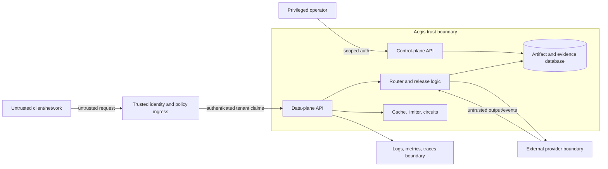
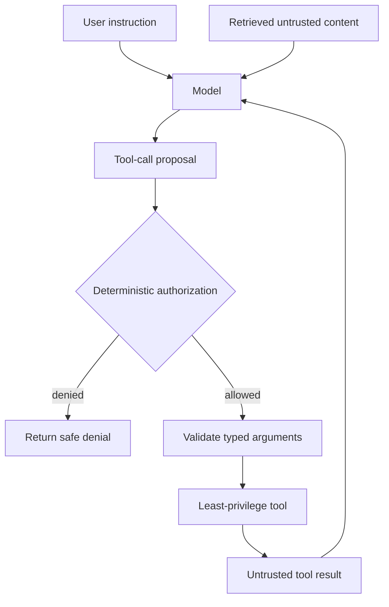

# Security and privacy threat model

This threat model covers the code in this repository and the deployment boundary it expects. It does
not claim that placing the container on the internet is safe. The reference service deliberately
leaves identity, tenant authorization, secret management, encryption, and distributed policy
enforcement to deployment infrastructure.

## Assets

The assets worth protecting are broader than provider API keys:

- prompt and conversation content;
- model outputs and structured business decisions;
- tenant, user, request, and release identifiers;
- provider credentials, quotas, and billing accounts;
- route policy, privacy/region declarations, and model catalogue;
- prompt, dataset, model, and policy artifacts;
- evaluation results and release thresholds;
- request evidence and rollback history;
- service availability and caller latency budget;
- integrity of model provenance and schema results.

## Trust boundaries

In the local reference, the identity ingress is absent and `tenant_id` comes from the request body.
The diagram shows the required production boundary, not an implemented authentication claim.

Route catalogues and registry content are trusted only after review. They can weaken policy by
falsely declaring a provider local, zero-retention, inexpensive, or region-compliant.

## Data classification and route policy

The router derives an effective privacy requirement:

| Classification | Effective route requirement |
|---|---|
| Public | Caller-requested privacy mode |
| Internal | Caller-requested privacy mode |
| Confidential + standard | Zero-retention |
| Confidential + stronger request | Requested stronger mode |
| Restricted | Local-only |

This mapping is enforced before utility ranking, preferred-route selection, canary assignment, and
fallback. A low-cost route cannot compensate for failing privacy.

Classification itself is caller supplied in the reference API. Production ingress should derive or
validate it using application context. If callers can label restricted data as public, the router is
faithfully enforcing a false premise.

## Implemented controls

### Input and schema validation

- Pydantic v2 rejects unknown fields.
- Identifier patterns and maximum lengths bound obvious abuse.
- Message count/content, output tokens, cost, latency, and temperature are constrained.
- Streaming and structured-output capabilities are inferred from request fields.
- JSON Schema output is parsed and validated before a complete response is accepted.

JSON Schema validates structure, not meaning or safety. A valid object can still contain a prompt
injection, false fact, harmful recommendation, or unauthorized identifier.

### Policy-first routing

- Capabilities, privacy, region, context, cost, latency, enabled state, and circuit health are hard
  filters.
- `global` is not a region wildcard.
- Preferred/forced routes remain subject to hard policy.
- Fallback uses only the already eligible candidate set.
- Restricted requests require a local-only declaration.

### Cache isolation

- Tenant is part of exact scope.
- Classification, privacy, schema, capability, region, budget, output limit, temperature, and prompt
  reference partition entries.
- Similarity search happens only inside a matching scope.
- TTL and maximum entry count bound retention and memory.

The cache holds plaintext output in process memory. Hashing keys does not encrypt values.

### Provider boundary

- Credentials come from secret settings/environment, not the route catalogue.
- Provider HTTP status and transport faults become stable typed errors.
- Error detail is bounded and raw provider bodies are not returned.
- Streaming parsers ignore unknown events and fail on malformed data.
- Mid-stream failure cannot silently splice output from another model.
- OpenAI requests set `store=false` in the adapter payload.

Provider-side retention and training controls depend on account, contract, endpoint, and model. One
payload flag is not a complete privacy program.

### Registry and release integrity

- Artifact content is canonicalized and hashed.
- A `(kind, name, version)` key cannot be overwritten with different content.
- Release IDs are unique.
- Candidate outcomes are release-scoped evidence.
- Offline gates run before the standard start-canary endpoint changes release state.
- Live guardrails can roll a candidate back.

### Secret hygiene

- `.env` is ignored.
- `.env.example` contains variable names and non-secret placeholders only.
- CI scans tracked text for common OpenAI, Anthropic, GitHub, and private-key shapes without printing
  candidate values.
- Telemetry's generic event helper drops attribute names containing `key`.

Pattern scanning is a useful tripwire, not a complete secret scanner. Use repository secret scanning
and pre-receive protection as well.

## Threat catalogue

| Threat | Example | Current control | Remaining work |
|---|---|---|---|
| Tenant spoofing | Caller submits another tenant ID | Cache/limit namespace exists | Derive tenant from verified OIDC/mTLS claim |
| Control-plane takeover | Leaked shared admin bearer | Constant-time bearer comparison | RBAC, short-lived auth, audit, network isolation |
| Route-policy tampering | Catalogue labels hosted route `local` | Strict parsing and source review | Signed config, approval policy, attestation |
| Cross-tenant cache disclosure | Similar prompt probes another tenant's output | Tenant-scoped cache identity | Trusted tenant identity, timing review |
| Cross-policy cache reuse | Lower-privacy request reuses restricted output | Policy-rich exact scope | Release/route namespace and invalidation |
| Prompt injection | Retrieved text asks model to reveal secrets | None at gateway semantic layer | Tool authorization, taint tracking, injection evals |
| Output injection | Model returns script/SQL/HTML consumed unsafely | JSON Schema when requested | Contextual output encoding and downstream validation |
| Data exfiltration | Restricted prompt routed to hosted model | Local-only hard filter | Accurate classification and verified egress controls |
| SSRF/configured egress abuse | Malicious base URL targets metadata service | Base URLs are deployment settings | Allowlisted HTTPS hosts, network policy, DNS controls |
| Retry amplification | Nested retries exhaust quota | One attempt per eligible route | End-to-end attempt budget across layers |
| Stream provenance confusion | Two model streams concatenated | No fallback after first delta | Client handling and signed provenance if needed |
| Evidence poisoning | Forged tenant traffic skews canary | Stable release IDs/rows | Authenticated event source, idempotency, anomaly checks |
| Denial of service | Long streams or many cache keys | Request bounds, request-rate bucket | Concurrency, body, memory, spend, and stream-duration limits |
| Supply-chain compromise | Dependency or container modified | Pinned major ranges, CI | Lockfile/hashes, SBOM, signing, provenance, scanning |
| Sensitive telemetry | IDs exported to shared log system | No prompt/output in default row | Identifier tokenization, field allowlist, retention |
| Database loss/tamper | SQLite volume deleted or edited | WAL, artifact hashes | Encryption, backups, access control, immutable audit |

## Prompt injection and tool safety

Aegis currently normalizes text generation; it does not expose a full tool-call execution loop. That
limits but does not remove prompt-injection risk. A model output can still be rendered in a browser,
used in SQL, passed to another model, or treated as a business decision.

When tool support is added:

The model proposes; deterministic code authorizes. Tool permissions must come from authenticated
user/tenant policy, never from text in the prompt or retrieved document. Validate arguments,
constrain network/file scopes, require confirmation for consequential actions, and treat tool results
as untrusted on re-entry.

Add adversarial cases for indirect prompt injection, data extraction, confused deputy behavior,
cross-tenant retrieval, and authorization bypass before advertising the `tools` capability.

## Authentication and authorization

### Data plane

Required production pattern:

1. Authenticate the client using OIDC, mTLS, or a service identity.
2. Derive tenant and user claims at ingress.
3. Authorize model capabilities, regions, classifications, and budgets for those claims.
4. Replace or reject conflicting body fields.
5. propagate a gateway-generated trace ID separately from caller correlation IDs.

Do not let a caller raise `max_cost_usd`, request a stronger model, or classify data without policy
authorization merely because the Pydantic value is valid.

### Control plane

The reference uses one bearer token from `AEGIS_ADMIN_TOKEN`. Before shared use, replace it with
scoped operations such as:

- artifact read/write;
- evaluation run;
- release create;
- canary start;
- promotion;
- rollback;
- evidence read;
- cache invalidation.

Promotion and policy changes should require stronger approval than reading metrics. Record actor,
reason, source commit, old/new state, and timestamp in an append-only audit log.

## Provider credentials

Use one credential or workload identity per environment and, where possible, per provider route
class. Limit allowed models, spend, and endpoints at the provider account level. Rotate credentials
without rebuilding the image.

Never send provider keys to clients, logs, traces, exception trackers, prompt registries, route
catalogues, or evaluation artifacts. If a key reaches source control, revoke and rotate it first;
history rewriting alone does not make it safe.

The process currently reads `OPENAI_API_KEY` and `ANTHROPIC_API_KEY`. Kubernetes expects an
`aegis-secrets` Secret, but the repository intentionally does not include a Secret manifest with
values.

## Network and egress

The included Kubernetes `NetworkPolicy` is a starting point, not a complete provider allowlist. DNS
names generally cannot be constrained by standard Kubernetes NetworkPolicy alone. Use an egress
gateway, firewall, service mesh, or cloud network control that can restrict destination and TLS
identity.

Protect against configured SSRF:

- allowlist provider base URLs by environment;
- require HTTPS except for explicitly local Ollama endpoints;
- block link-local, loopback, and metadata-service destinations for hosted adapters;
- validate DNS resolution and prevent rebinding at the egress layer;
- do not expose base URL settings through the public API.

## Streaming-specific risks

Streaming publishes output before final JSON Schema validation and before a complete safety decision
can inspect the whole response. If downstream actions require validated data, buffer until the final
event or use non-streaming mode.

Set proxy idle and maximum-duration limits, but distinguish a legitimate long generation from a
stalled connection. Bound client write buffers so a slow reader cannot retain unbounded model output
in memory.

## Denial-of-service controls

Implemented bounds cover many request fields, but production needs limits at several layers:

| Layer | Required limits |
|---|---|
| Ingress | Body/header size, connection rate, authentication failures |
| Tenant | Requests, concurrent requests, tokens, spend, stream duration |
| Gateway | Global in-flight work, queue depth, memory, file descriptors |
| Route | Concurrent calls, provider QPS/TPM, model context, output tokens |
| Control plane | Evaluation size, artifact size, mutation rate |
| Cache | Entries, bytes, TTL, per-tenant quota |

The current limiter controls request starts per tenant in one process. It does not make the service
safe against a small number of very expensive requests.

## Supply-chain and build security

Before production:

1. Produce a locked dependency set with hashes.
2. Scan dependencies and container layers for known vulnerabilities.
3. Generate an SBOM.
4. Build in CI with ephemeral credentials and minimum permissions.
5. Sign the image and attest source commit/build workflow.
6. Deploy by immutable digest rather than a mutable tag.
7. Set GitHub Actions permissions explicitly; the included workflow uses read-only contents.
8. Protect `main`, require checks, and require review for route/security changes.
9. Review base-image updates and rebuild regularly.

## Security test cases

At minimum, keep automated tests for:

- unknown request fields rejected;
- malformed tenant IDs and over-limit values rejected;
- confidential data upgraded to zero-retention;
- restricted data restricted to local-only routes;
- region mismatch fails closed;
- budget/context/capability mismatch fails closed;
- preferred, forced, canary, and fallback paths cannot bypass hard filters;
- semantic cache cannot cross tenant, classification, privacy, schema, region, budget, or generation
  scope;
- provider error bodies are bounded and keys never appear in logs;
- mid-stream failure cannot switch models;
- artifact overwrite raises a conflict;
- control endpoints reject missing/incorrect credentials;
- shadow traffic is isolated and attached to the correct release.

Add deployment tests for TLS policy, egress restrictions, secret mounting, pod security, encrypted
volumes, identity claims, and log redaction. Unit tests cannot verify infrastructure assertions.

## Incident response for exposed credentials

1. Revoke the credential at the provider immediately.
2. Issue a replacement with narrower permissions if possible.
3. Identify where it was exposed: source, log, trace, shell history, artifact, issue, or build output.
4. Search provider audit and usage records for abuse.
5. Remove the value from active systems and then clean retained history according to policy.
6. Add a detection rule or process control that would have prevented the path.
7. Document cost and data exposure separately; key exposure does not prove prompt exposure, and the
   absence of unusual spend does not prove no access.

## Production hardening checklist

- [ ] Trusted OIDC/mTLS ingress derives tenant identity.
- [ ] Per-operation RBAC replaces the shared admin token.
- [ ] Provider hosts and egress are allowlisted.
- [ ] Secrets come from a managed secret store or workload identity.
- [ ] Database, volumes, and backups are encrypted and access controlled.
- [ ] Distributed rate limits include concurrency, token, and spend budgets.
- [ ] Cache has per-tenant byte limits, release namespace, and deletion support.
- [ ] Prompt-injection and exfiltration suites gate tool-enabled routes.
- [ ] Logs/traces use an explicit field allowlist and tested redaction.
- [ ] Dependencies and images are locked, scanned, signed, and deployed by digest.
- [ ] Artifact and release changes are audited with actor identity.
- [ ] Backup, restore, rollback, and credential-rotation drills have been completed.
