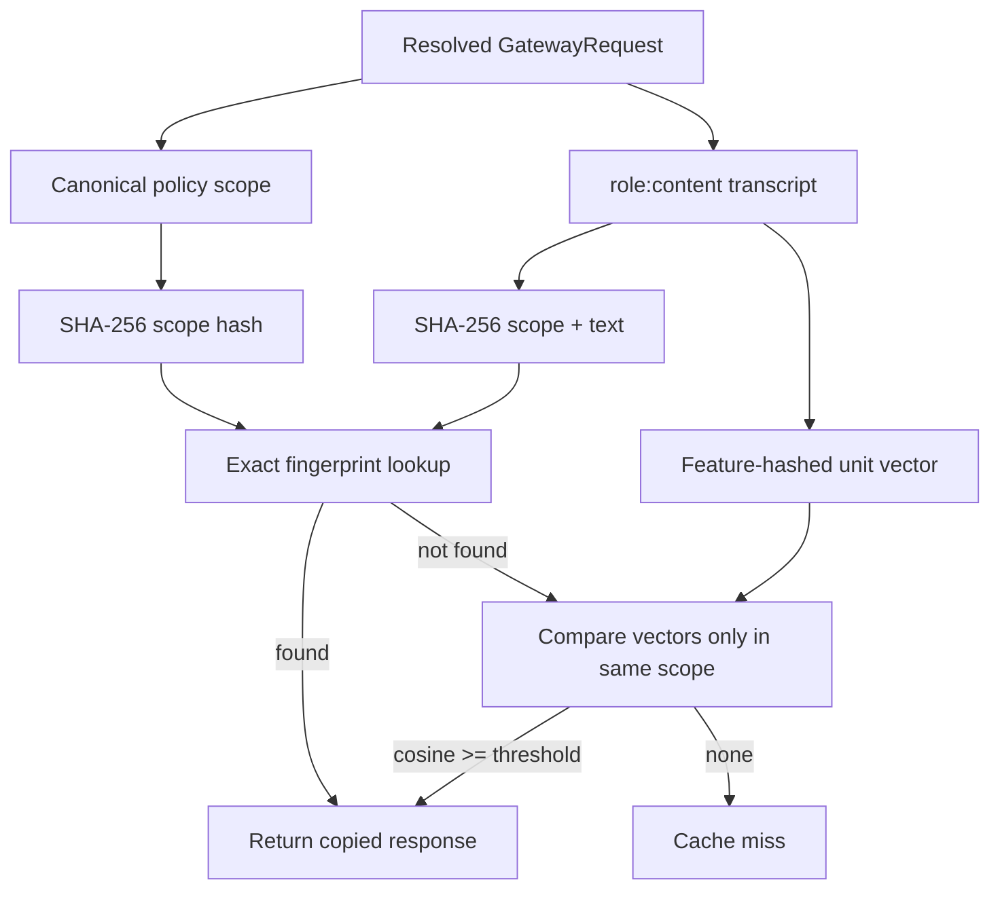

# Semantic cache

The cache exists to avoid repeated inference for sufficiently similar requests, but a cache hit is
also a routing decision: it reuses output produced under an earlier policy context. A prompt-only
cache key is therefore unsafe for a multi-tenant gateway.

Aegis separates cache identity into two parts:

- a **scope** containing policy and generation fields that must match exactly;
- a **text vector** used for similarity only inside that scope.

## Lookup model

The exact fingerprint is checked first. Semantic search is a bounded scan of entries whose scope
matches. A hit returns a Pydantic copy with `cache_hit=true`; the stored object is not mutated.

## Exact policy scope

The scope currently includes:

| Field | Why it partitions reuse |
|---|---|
| execution namespace | Separates default, forced-route, and release/route lanes |
| `tenant_id` | Prevents cross-tenant disclosure and policy confusion |
| `data_classification` | Keeps restricted/confidential outputs in their original classification |
| `privacy_mode` | Prevents reuse across processing guarantees |
| response schema hash | Prevents one output contract satisfying another by accident |
| required capabilities | Distinguishes streaming/structured and future modality expectations |
| allowed regions | Preserves the residency context under which output was produced |
| maximum cost | Keeps cache behavior stable across caller budget policy |
| maximum latency | Keeps cache behavior stable across caller latency policy |
| maximum output tokens | Prevents a long answer satisfying a caller that requested a tighter bound |
| temperature | Separates deterministic and higher-variance generation settings |
| prompt reference | Pins prompt artifact name/version intent |

The role-prefixed message transcript is part of the fingerprint and vector text. Role prefixes avoid
making `system: X; user: Y` identical to `user: X; assistant: Y`.

Fields such as `request_id`, `user_id`, `metadata`, `cache_mode`, and `shadow_enabled` are not in the
scope. They control execution or telemetry rather than requested content in the current adapters. If
a provider starts using one of those fields to personalize output, it must become part of identity or
be prohibited on cacheable requests.

The service chooses the namespace before lookup. Normal traffic without a release uses `default`;
forced requests use the forced route ID; release traffic uses the immutable release ID plus preferred
route. Canary, shadow, and evaluation executions bypass lookup and insertion. Namespace selection is
an orchestration rule rather than a caller-controlled request field.

## Canonicalization and hashes

The response schema is serialized with sorted keys and compact separators before SHA-256 hashing.
Scope data is also serialized with sorted keys, using string conversion for enums. The exact
fingerprint is:

\[
f = SHA256(scope\_hash \;||\; "\\n" \;||\; transcript)
\]

SHA-256 here is an identity tool, not encryption. Cache entries still contain plaintext model output
in process memory. Sensitive deployments need encrypted external storage, retention controls, and
erasure semantics even if keys are opaque hashes.

## Feature-hashing embedder

The dependency-free `HashingEmbedder` tokenizes Unicode word-like spans, lowercases them, and maps
each token into one of `d=1024` dimensions using SHA-256. A second digest byte chooses a sign. For
token `t`:

\[
i(t)=integer(SHA256(t)_{0:4}) \bmod d
\]

\[
s(t)=\begin{cases}+1,& digest_4\;\&\;1=1\\-1,& otherwise\end{cases}
\]

The sparse count vector is:

\[
v_i=\sum_{t:i(t)=i}s(t)
\]

and is normalized to unit L2 length:

\[
\hat{v}=\frac{v}{\sqrt{\sum_i v_i^2}}
\]

Similarity is a sparse dot product, equivalent to cosine similarity for unit vectors:

\[
sim(a,b)=\hat{v}_a\cdot\hat{v}_b
\]

The default threshold is `0.96`. Empty text yields an empty vector and cannot produce a semantic hit.

Feature hashing is fast, deterministic, offline, and good enough to exercise the architecture. It is
not semantic in the neural-embedding sense. Synonyms do not naturally align; hash collisions can
create noise; word order is ignored. The `EmbeddingBackend` protocol exists so a deployment can
replace it without changing cache isolation.

## Complexity and memory

For `N_s` entries in one scope and `z` non-zero dimensions in a request vector, lookup is roughly:

\[
O(N_s \cdot z)
\]

because the reference implementation scans matching entries. The total cache is bounded by
`max_entries` (10,000 by default in code), and an `OrderedDict` supplies LRU ordering.

Each entry holds:

- scope and fingerprint strings;
- a sparse Python dictionary of integer/float pairs;
- a complete `GatewayResponse`, including text;
- an expiry timestamp;
- Python object overhead.

Python dictionary overhead dominates the raw vector values. Do not estimate capacity as
`nonzeros * 12 bytes`. Measure representative process RSS with real prompt and output sizes, then set
the bound below the pod's memory limit.

## TTL and LRU behavior

Entries receive `expires_at = clock + ttl` at insertion. Expired entries are removed lazily during
`get` and `size`; there is no background sweeper. If no cache calls occur, expired objects remain in
memory until the next operation.

Insertion moves the fingerprint to the end of the ordered dictionary. Hits also move entries to the
end. When capacity is exceeded, the least recently used item is removed.

TTL is freshness, not policy revocation. If a prompt or model output must be invalidated immediately,
operators should clear the cache or rotate an identity field such as a pinned prompt version. The
current control API clears all entries; selective tenant or artifact invalidation is a useful next
extension.

## Cache modes

| Mode | Lookup | Insert after success | Intended use |
|---|---:|---:|---|
| `default` | Yes | Yes | Normal online traffic |
| `bypass` | No | No | Evaluation, diagnostics, deliberately fresh output |
| `refresh` | No | Yes | Regenerate and replace exact entry |

Offline evaluation and shadow traffic bypass cache regardless of caller mode. Evaluating a cached
answer would measure the cache, not the candidate route.

## Response accounting on a hit

A hit is copied and rewritten with:

- the current request ID;
- `cache_hit=true`;
- current creation time;
- lookup elapsed time as TTFT and latency;
- zero input tokens, output tokens, and provider cost.

The route/provider/model fields remain those of the original response. That provenance is useful: a
cached output does not become output of whichever route the current policy would have selected.

## Failure and consistency semantics

The in-memory cache cannot independently fail in the reference implementation. A networked
replacement should degrade to a miss for availability, while emitting an operational metric. It
must never degrade by dropping scope fields or widening tenant partitions.

With multiple replicas and independent caches:

- hit rates differ by replica;
- an invalidation reaches only one process;
- LRU order and expiry are not shared;
- semantic duplicates can be stored many times.

Those are efficiency problems until immediate invalidation or global retention guarantees are
required. At that point, use a shared store with explicit tenant partitions and versioned key format.

## Threats and controls

### Cross-tenant probing

An attacker can submit semantically similar prompts and inspect latency or content for evidence of
another tenant's query. Exact tenant scope prevents both content reuse and the fast-hit timing signal
across tenants. A trusted ingress must supply tenant identity; caller-controlled tenant IDs defeat
that boundary.

### Prompt injection persistence

A malicious or low-quality response can be amplified by caching. Only successful, schema-valid
responses are inserted, but schema validity says nothing about safety or factual quality. Routes that
use tools or retrieval should include tool policy, corpus version, authorization scope, and relevant
guardrail version in the cache identity before caching is enabled.

### Semantic collision

A lower threshold increases hit rate and false reuse. Test the threshold on labeled prompt pairs and
measure false-positive rate by task family. Security-sensitive exact tasks may need threshold `1.0`
or cache bypass.

### Deletion requests

An in-memory cache can be cleared globally, but it has no per-user index. If regulation or customer
contracts require subject-specific erasure, use a store that can enumerate keys by the authoritative
subject identifier and prove deletion across replicas and backups.

## Replacing the embedder or store

A neural embedder should preserve these rules:

1. Perform exact scope partitioning before approximate search.
2. Version the embedding model and include that version in stored metadata or key space.
3. Normalize vectors consistently and document the distance metric.
4. Bound query candidates and latency; cache lookup must not consume the provider deadline.
5. Reject dimensions/model versions that do not match the index.
6. Keep original text out of a third-party embedding API unless the same privacy and region policy
   authorizes that API.
7. Evaluate false positive and false negative rates using real request pairs.

For Redis or a vector database, use a compound partition key such as `(tenant, policy_scope_hash,
embedding_version)`, a TTL enforced by the store, and a response envelope with a schema version.
Cache storage is not a shortcut around migration discipline.
