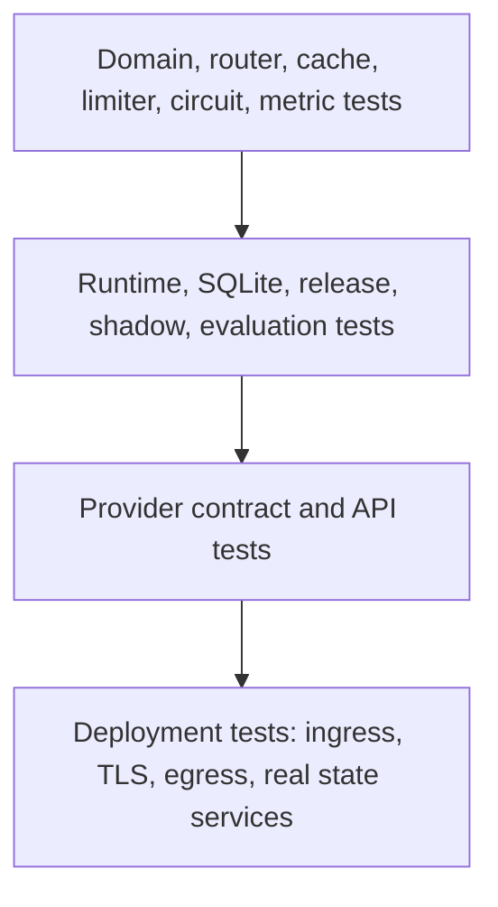

# Test strategy

The test suite is designed around invariants and failure boundaries. It runs without provider keys or
network access, which makes it suitable for pull requests and prevents accidental API spend.

## Quality gates

```bash
make check
```

The target runs:

1. Ruff lint and format verification;
2. strict mypy over the package;
3. pytest with branch coverage and a 95% minimum;
4. a credential-pattern scan over repository text;
5. a deterministic 250-request concurrency benchmark with success/p99 assertions.

Run individual stages during development:

```bash
make lint
make type
make test
make security
make benchmark
```

## Test pyramid



The repository includes the lower three layers. Deployment tests require an environment and are
listed as launch work rather than faked in unit tests.

## Deterministic runtime fixture

Tests construct a full `Runtime` with:

- a temporary SQLite path;
- the real route catalogue;
- high test rate limits;
- warning-level logs;
- deterministic mock routes;
- the real router, cache, registry, release manager, evaluator, telemetry, and service.

This catches integration errors—transaction shape, background shadow evidence, cache ordering—that
isolated mocks miss, while remaining fast enough for every commit.

## Domain and configuration tests

`test_domain_config.py` checks capability inference, unknown-field rejection, catalogue parsing,
duplicate route IDs, and invalid catalogue shape.

Important future cases:

- unsupported schema keywords per provider;
- route metadata version requirements;
- impossible privacy/capability combinations;
- environment setting bounds and invalid secret configuration.

## Router tests

`test_router.py` verifies:

- utility weights sum to one;
- deterministic utility ranking and tie behavior;
- eligible preferred-route selection and positive regret;
- every hard rejection reason;
- classification-driven privacy strengthening;
- forced and excluded routes;
- open circuits;
- token-metered actual cost.

Policy tests should prove negative properties. It is not enough to show that a local route can be
selected; tests must show that a restricted request cannot select any non-local route through normal,
preferred, forced, canary, or fallback paths.

## Cache tests

`test_cache.py` injects a controllable monotonic clock and verifies:

- exact hits;
- semantic hits;
- tenant isolation;
- classification, privacy, schema, region, cost, latency, and temperature scope;
- TTL expiration;
- LRU capacity eviction;
- cache clear;
- embedder configuration and empty vectors.

Any field added to provider generation semantics should trigger a cache-identity test. A missing
field can become a data leak or experiment contamination, not merely stale data.

## Resilience tests

`test_resilience.py` uses a fake clock to test token refill without sleeping. Circuit tests cover
closed, open, half-open, single-probe, recovery, and probe failure behavior.

`test_service.py` covers the full candidate loop:

- normal generation and durable evidence;
- zero-cost cache-hit accounting;
- bypass and refresh semantics;
- forced-route, canary, and active-release cache isolation;
- route-scoped outage fallback;
- a circuit opening between route selection and attempt admission;
- schema failure fallback;
- non-retryable provider-request failure;
- complete and streaming cancellation at the total provider-wait deadline;
- prompt artifact rendering and missing variables;
- complete streaming and streaming cache hits;
- fallback before output;
- interruption after output;
- final stream schema failure;
- release-scoped shadow evidence;
- automatic rollback after a terminal canary failure.

## Provider contract tests

`test_providers.py` uses `httpx.MockTransport` to capture outbound requests and return controlled
responses. Tests assert:

- authentication headers and base URL behavior;
- current provider-specific payload fields;
- complete response extraction;
- SSE frame parsing across data lines;
- NDJSON parsing;
- token usage and model identity;
- terminal stream error conversion;
- missing credential behavior;
- status-code and transport error taxonomy;
- adapter registry health and close behavior.

These are fixture contract tests, not proof that a provider has not changed. Review provider
changelogs and run a small gated live contract workflow before enabling a new model/deployment.

## API tests

FastAPI tests run in-process through `httpx.ASGITransport`. They cover health, metrics, console,
admin authentication, native complete/stream responses, typed error envelopes, compatibility
complete/stream behavior, structured output, artifacts, evaluations, release workflow, rollback,
and evidence endpoints.

Because the transport bypasses a real proxy, it cannot detect SSE buffering, header stripping, TLS,
body limits, or connection-drain problems. Those belong in deployment tests.

## Release and evaluation tests

Registry tests use real temporary SQLite files and cover:

- idempotent initialization;
- artifact immutability and latest lookup;
- release state and live priority;
- evidence filtering and aggregate denominators;
- evaluation persistence;
- stable canary assignment and shadow opt-out;
- live SLO breach rollback;
- manual rollback audit row.

Evaluation tests cover normalized exact/substring quality, schema cases, per-case exception capture,
empty dataset rejection, persistence, and multi-condition release gate messages.

## Fault injection

The deterministic adapter accepts test metadata:

```json
{
  "metadata": {
    "mock_failure": "timeout",
    "mock_failure_route": "mock-primary"
  }
}
```

Supported failure values are `rate_limit`, `timeout`, `auth`, and `unavailable`. Route scoping allows
the first route to fail while a second mock route succeeds, exercising real fallback order.

Do not expose mock routes in a production catalogue. Metadata-driven test faults are safe only when
the adapter itself is not reachable by production policy.

## Coverage philosophy

Branch coverage is enforced because many important gateway behaviors are error branches. A line-only
metric can report a parser as covered even when terminal events, malformed frames, and missing usage
never run.

The threshold is a floor, not the goal. High coverage does not prove:

- privacy declarations are true;
- provider APIs still match fixtures;
- evaluation labels are correct;
- distributed systems preserve local invariants;
- the model is safe or useful.

Prefer a small test with a clear invariant over a test that invokes many lines without an assertion
about behavior.

## Concurrency benchmark

`scripts/run_benchmark.py` creates a temporary database, sets a high test admission rate, bypasses
cache, and runs distinct deterministic requests under an asyncio semaphore. It reports wall time,
throughput, evidence-derived p99, success, schema, cost, and regret.

```bash
python scripts/run_benchmark.py --requests 1000 --concurrency 50 --assert-slo
```

The asserted 500 ms p99 is a regression guard for local gateway overhead in CI. It is not a provider
latency SLO and results across laptops/runners are not directly comparable.

## Secret scan

`scripts/scan_secrets.py` scans supported text files and fails on common OpenAI, Anthropic, GitHub,
and private-key shapes. It prints only file paths, never the candidate value.

Also enable GitHub secret scanning and push protection. Regex cannot detect every credential format
or secret embedded in binary artifacts.

## Live provider tests

Keep live tests separate from pull-request CI. A safe workflow should:

1. require manual or protected-environment approval;
2. use a dedicated low-spend provider project;
3. allowlist exact route/model IDs;
4. use non-sensitive fixed prompts;
5. cap cases, output tokens, concurrency, and total spend;
6. tolerate provider rate limits without retry storms;
7. record adapter/API versions;
8. revoke secrets from forked or untrusted workflows.

The ordinary test suite should remain fully useful when every provider is offline.

## Deployment test plan

Before calling an environment production-ready, automate:

- trusted tenant extraction and body-claim override;
- TLS/mTLS and authorization rejection;
- egress allowlist and cloud metadata denial;
- provider DNS/TLS timeout behavior;
- proxy SSE flush and idle timeout;
- pod termination with streams and shadow tasks in flight;
- database lock, disk full, failover, backup, and restore;
- distributed quota atomicity during autoscaling;
- cache partition/invalidation across replicas;
- concurrent release promotion/rollback;
- metrics/log redaction and cardinality limits;
- image signature and policy admission.

## Adding a regression test

For an incident-derived test:

1. state the broken invariant in the test name;
2. reproduce with the smallest public contract;
3. avoid real credentials, network, and wall-clock sleeps;
4. assert the typed error, route, evidence, or state transition—not only status code;
5. prove the fix does not weaken privacy or fallback constraints;
6. place provider payload fixtures in the adapter test where applicable;
7. run `make check` before commit.
